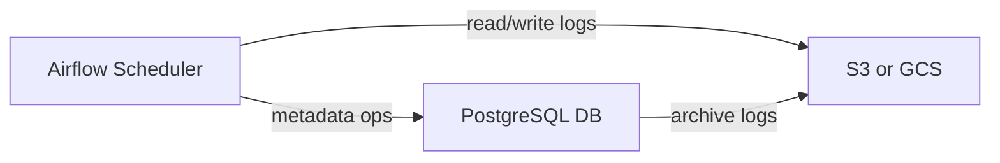
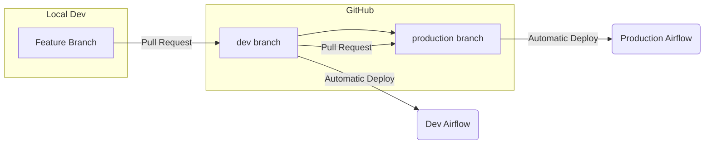

Below is a **comprehensive** set of Obsidian notes on **Airflow CICD** and best practices for running Airflow in production (including Kubernetes, CI/CD, monitoring, and optimization). These notes include **code snippets**, **examples**, **visual references**, and **detailed explanations** suitable for anyone looking to set up a robust Airflow environment. 

tags: [airflow, cicd, data-engineering, kubernetes]
## Table of Contents
1. [[#Introduction|Introduction]]
2. [[#Running Airflow in Production|Running Airflow in Production]]
   - [[#Why-Kubernetes|Why Kubernetes?]]
   - [[#Executors-and-Choosing-Between-Kubernetes-and-Celery|Executors (Kubernetes vs Celery)]]
   - [[#Metadata-Database-and-Logging|Metadata Database & Logging]]
3. [[#CI-CD-Best-Practices|CI/CD Best Practices]]
   - [[#Branching-Strategy-and-Flow|Branching Strategy & Flow]]
   - [[#Local-Development-with-Docker|Local Development with Docker]]
   - [[#Automated-Testing-with-Pytest|Automated Testing (Pytest)]]
4. [[#DAG-Writing-Best-Practices|DAG Writing Best Practices]]
   - [[#Avoid-Top-Level-Code|Avoid Top-Level Code]]
   - [[#Retries-and-Error-Handling|Retries & Error Handling]]
   - [[#Atomicity|Atomicity]]
   - [[#Idempotency|Idempotency]]
   - [[#Modular-and-Reusable-Operators|Modular & Reusable Operators]]
5. [[#Monitoring-and-Optimization|Monitoring & Optimization]]
   - [[#Observability-Tools|Observability Tools]]
   - [[#Metrics-to-Monitor|Metrics to Monitor]]
   - [[#Scaling-Insights|Scaling Insights]]
6. [[#Summary|Summary]]

---

## Introduction
Airflow is a popular **orchestration tool** for managing data pipelines (ETL/ELT), ML workflows, and task scheduling. When running Airflow in a **production environment**, there are several considerations to ensure **scalability**, **reliability**, and **cost-effectiveness**:

- **Infrastructure**: Container orchestration (Kubernetes) is typically recommended.
- **Executor Choice**: Celery vs Kubernetes executors for various usage scenarios.
- **CI/CD**: Proper branching strategies, automated testing, and environment promotion pipelines.
- **Monitoring**: Worker usage, scheduler health, system resource utilization.
- **Optimization**: Ensuring tasks are atomic, idempotent, and properly sized for worker resources.

This note covers **best practices** on each of these topics.

---

## Running Airflow in Production

### Why Kubernetes?
- **Scalability**: Airflow can dynamically spin up multiple worker pods to handle spikes in task volume and spin them down when idle.
- **Cost-Effectiveness**: When tasks are idle, worker nodes can scale down—*potentially to zero*—ensuring you’re not paying for unused compute.
- **Isolation**: If you use the KubernetesExecutor, each task runs in its own isolated pod, ensuring environment isolation.

> **Tip:** If managing Kubernetes yourself is too complex, consider a managed Airflow service (e.g., [Astronomer](https://www.astronomer.io/) or [MWAA on AWS](https://aws.amazon.com/managed-workflows-for-apache-airflow/)). These can handle much of the underlying infrastructure, scaling, and upgrades automatically.

### Executors and Choosing Between Kubernetes and Celery
- **KubernetesExecutor**  
  - Spawns a new pod for *each task*, providing strong **per-task isolation**.  
  - Overhead in launching pods can be higher, which may **slow down** task spin-up.  
- **CeleryExecutor**  
  - Uses a **shared worker pool**. Faster spin-up since workers are pre-booted.  
  - Tasks are less isolated because they share a Celery worker environment.  
  - Often **less expensive** and **faster** for many parallel tasks with similar dependencies.

**Rule of Thumb**:  
- Use **CeleryExecutor** unless you have strong isolation requirements or widely differing dependency needs.  
- Always run the Airflow components (webserver, scheduler, workers) on **Kubernetes** for easy container orchestration and scaling.

### Metadata Database and Logging
- Airflow stores workflow states and history in a **metadata database** (PostgreSQL or MySQL are common choices).  
- If you have extremely large DAGs or heavy use of **XCom** (inter-task messaging), ensure your metadata database is appropriately sized.  
- **Long-lived Logs**:  
  - Use an **object store** like **S3** or **GCS** for persistent log storage.  
  - Archive older logs and metadata periodically (e.g., every 30 days) to avoid growing the metadata DB indefinitely.



---

## CI/CD Best Practices

### Branching Strategy and Flow
A **common** approach:

1. **production** branch → Deployed to **Production Airflow** 
2. **dev** branch → Deployed to **Development Airflow** 
3. Developers create **feature branches** locally or on a fork:
   - Merge into **dev** for testing in Dev environment.
   - Once approved, merge **dev** → **production** for final deployment.



### Local Development with Docker
- **Dockerize Airflow** so that local development matches **production**.  
- By using **Docker** or **docker-compose**, you can spin up a local Airflow environment with the *same dependencies* as in production.

**Example `docker-compose.yml` snippet**:

```yaml
version: '3'
services:
  airflow-webserver:
    image: your-registry/airflow:latest
    environment:
      - LOAD_EX=n
      - EXECUTOR=Celery
    ports:
      - "8080:8080"
    depends_on:
      - airflow-scheduler
      - airflow-worker

  airflow-scheduler:
    image: your-registry/airflow:latest
    restart: always
    depends_on:
      - airflow-worker

  airflow-worker:
    image: your-registry/airflow:latest
    restart: always
```

> **Workflow**: Developers pull the latest Docker image, run Airflow locally, test DAG changes, then push changes to Git.

### Automated Testing with Pytest
- Add a **Pytest** suite to run whenever a Pull Request is created or merged.  
- Ensure it checks for:
  - DAG **syntax** and **import** correctness (no parse errors)  
  - Unique DAG IDs  
  - Mandatory tags or owners  
  - Best practice checks (e.g., presence of `retries`, not using top-level code, etc.)

**Example `test_dags.py`:**

```python
import pytest
from airflow.models import DagBag

def test_no_import_errors():
    """
    Ensure there are no import errors in our DAG files.
    """
    dag_bag = DagBag(dag_folder="dags", include_examples=False)
    assert len(dag_bag.import_errors) == 0, f"Errors found: {dag_bag.import_errors}"

def test_unique_dag_ids():
    """
    Ensure each DAG ID is unique.
    """
    dag_bag = DagBag(dag_folder="dags", include_examples=False)
    dag_ids = [dag.dag_id for dag in dag_bag.dags.values()]
    assert len(dag_ids) == len(set(dag_ids)), "Duplicate DAG IDs found!"

def test_dag_tags():
    """
    Example test to ensure each DAG has at least one tag.
    """
    dag_bag = DagBag(dag_folder="dags", include_examples=False)
    for dag_id, dag in dag_bag.dags.items():
        assert len(dag.tags) > 0, f"DAG {dag_id} has no tags!"

# Add more checks as needed for retries, default_args, etc.
```

---

## DAG Writing Best Practices

### Avoid Top-Level Code
- **What it means**: Code that executes outside of the DAG/task context (i.e., global scope in the DAG file).  
- **Why avoid it**: Airflow’s DAG parsing runs frequently; heavy top-level code slows the scheduler.

**Example (Bad):**

```python
# This code runs at parse time for EVERY parse!
large_df = pd.read_csv("huge_file.csv")

with DAG(...) as dag:
    ...
```

**Example (Good):**

```python
def load_data(**context):
    large_df = pd.read_csv("huge_file.csv")
    # do something

with DAG(...) as dag:
    load_task = PythonOperator(
        task_id="load_data",
        python_callable=load_data,
        provide_context=True
    )
```

### Retries and Error Handling
- Use **automatic retries** in `default_args` or per task.  
- Helps recover from transient errors (e.g., network issues, momentary unavailability).

```python
default_args = {
    "owner": "data-team",
    "retries": 3,
    "retry_delay": timedelta(minutes=5)
}

with DAG(dag_id="example_dag", default_args=default_args, ...):
    ...
```

### Atomicity
- **Each task** should handle exactly **one logical step** (e.g., extract, transform, load).  
- Easier debugging, re-runs, and better clarity on pipeline progress.


### Idempotency
- Tasks should **always** produce the same output given the same input/state.  
- Ensures safe **retries** and **backfills** without unexpected side effects.

### Modular and Reusable Operators
- Use **Airflow Providers** instead of writing everything from scratch.  
- Create **custom operators** if you have repeated logic.  
- Avoid copying/pasting large blocks of Python code into each DAG.

---

## Monitoring and Optimization

### Observability Tools
- **Built-in** Airflow logs in the web UI (task-level logs).  
- **External** Observability (e.g., Grafana, Prometheus, or an Airflow-managed provider’s built-in dashboards).

**Sample metrics to export**:
- Number of running tasks
- Scheduler CPU / memory usage
- Worker CPU / memory usage
- DAG run success/fail counts
- Task latency (time to start + execution time)

### Metrics to Monitor
1. **Scheduler Health**  
   - CPU & memory usage.  
   - Scheduler *heartbeat* – ensure it’s consistently beating.  
2. **Worker Utilization**  
   - CPU & memory usage.  
   - If utilization is < 30% or so, consider decreasing worker size.  
   - If constantly ~100%, consider scaling up or out.  
3. **Task Failures/Retries**  
   - High retry/failure rates might indicate code or resource issues.

### Scaling Insights
- The goal is to **optimize** so you’re not overpaying for idle workers, nor failing tasks because of insufficient compute.
- If you see heavy bursts that saturate workers or scheduler, consider **horizontal scaling** (more pods) or **vertical scaling** (larger pods).

---

## Summary
Implementing Airflow in **production** requires:

- **Kubernetes** for dynamic scaling and isolation.
- **Executor Choice** that fits your use case (Celery vs. Kubernetes).
- **CI/CD** with automated tests (Pytest) and branching strategies to control environment deployments.
- **DAG Best Practices**: Avoid top-level code, ensure atomic tasks, incorporate retries, enforce idempotency.
- **Monitoring & Optimization**: Keep an eye on resource utilization, worker/scheduler metrics, and logs to fine-tune performance.

By following these **best practices**, you’ll have a more **stable**, **scalable**, and **cost-effective** Airflow environment. Adapt these guidelines to fit your organization’s size, data flow complexity, and compliance needs.

> **Further Reading**:  
> - [Apache Airflow Official Docs](https://airflow.apache.org/docs/)  
> - [Astronomer Registry for Providers/Integrations](https://registry.astronomer.io/)  
> - [Airflow Production Deployment Strategies](https://airflow.apache.org/docs/apache-airflow/stable/best-practices.html)

---

**_End of Notes_**