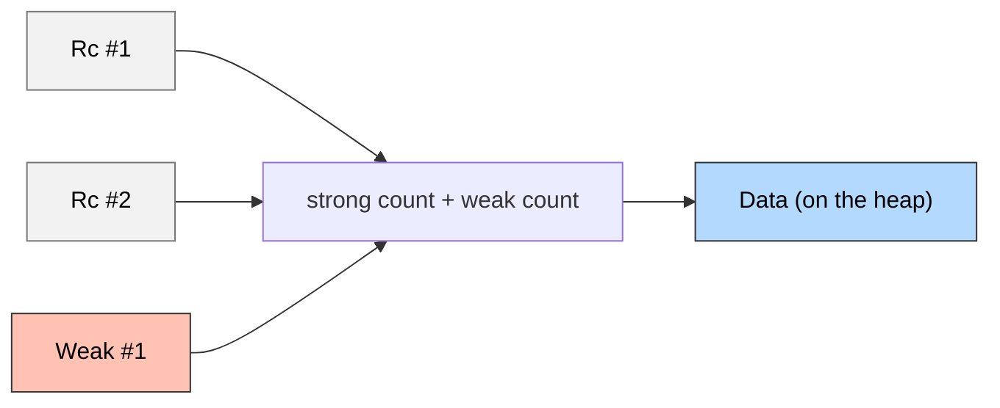

aliases: [Reference Counting, Rc, Shared Ownership in Rust, Smart Pointers]
tags: [rust, engineering, advanced, reference-counting, memory-management]

**Context:** In Rust, **reference counting** is a way to share ownership of data so that multiple parts of a program can hold references (pointers) to the same piece of data without requiring explicit copies for each holder. The `std::rc::Rc<T>` type provides such reference counting **on a single thread** (i.e., it is **not** `Send` or `Sync`).
## Rust's Single-Threaded Reference Counting
## 1. **Introduction to `Rc`**
**`Rc<T>`** (short for *Reference Counted*) is used when:
- You want **multiple owners** of a single piece of data within **one thread**.
- You **do not** need thread safety for the reference counts (→ `Rc` uses *non-atomic* increments/decrements).
- You need to **share** data, but **not** mutate that data directly (by default, `Rc<T>` only provides shared borrows).
### Key Properties
1. **Single-threaded** only—cannot be sent across threads.
2. `Rc<T>` is **not** `Send` and **not** `Sync`.
3. Reference counting is done via two integers inside the allocation:
   - **Strong count**: number of active `Rc<T>` pointers.
   - **Weak count**: number of `Weak<T>` pointers that do not keep the data alive, but keep the allocation’s memory reserved until all weak pointers are gone.



> **Figure:** A conceptual diagram of `Rc` and `Weak` pointers sharing reference counts.


---

## 2. **Basic Usage of `Rc`**

### 2.1 Creating a new `Rc<T>`

The simplest way to create an `Rc<T>` is via:
```rust
use std::rc::Rc;

let shared_data: Rc<i32> = Rc::new(10);
```

- This **allocates** an `RcBox<T>` containing your value (`10`) on the heap.
- The strong count becomes `1`.
- There is an “implicit weak” count used for bookkeeping (starts at `1` as well).

### 2.2 Cloning an `Rc<T>`

When you `clone` an `Rc<T>`:
```rust
let rc1 = Rc::new(vec![1.0, 2.0, 3.0]);
let rc2 = Rc::clone(&rc1);  // or rc1.clone()
```
- Both `rc1` and `rc2` point to the **same** allocation.
- The **strong count** is increased by `1`.
- **Cloning** an `Rc<T>` **does not** copy the underlying data; it only increments the reference count.

### 2.3 Checking strong and weak counts

```rust
println!("Strong count: {}", Rc::strong_count(&rc1)); // e.g., 2
println!("Weak count: {}", Rc::weak_count(&rc1));     // e.g., 0
```

### 2.4 Dropping an `Rc<T>`

When an `Rc<T>` goes out of scope or is explicitly dropped:
- The **strong count** is decremented.
- When the strong count hits `0`, the underlying data is dropped. 
- Afterwards, if the **weak count** is also `0`, then the memory is deallocated.

```rust
{
    let rc1 = Rc::new(100);
    let rc2 = Rc::clone(&rc1);

    println!("Count before drop: {}", Rc::strong_count(&rc1)); // 2

    drop(rc2);
    println!("Count after drop: {}", Rc::strong_count(&rc1));  // 1
}
// Here rc1 gets dropped, strong count → 0 → data is dropped
```

---

## 3. **Immutability & Interior Mutability**

`Rc<T>` gives you **shared** (`&T`) rather than **unique** (`&mut T`) ownership. Therefore, by default, one **cannot** mutate `T`.

For mutation, use interior mutability patterns:
- [`RefCell<T>`](https://doc.rust-lang.org/std/cell/struct.RefCell.html)
- [`Cell<T>`](https://doc.rust-lang.org/std/cell/struct.Cell.html)

Example:
```rust
use std::cell::RefCell;
use std::rc::Rc;

let data = Rc::new(RefCell::new(vec![1, 2, 3]));
data.borrow_mut().push(4); // modifies the inner vector
```

> **Note**: Interior mutability allows run-time checks that ensure no data races occur within a single thread.

---

## 4. **Weak References**

### 4.1 Why `Weak`?

If you only use `Rc` pointers, you can accidentally create **reference cycles**. For instance, a tree structure with parent ↔ child references as `Rc<T>` for both directions would lead to a cycle where the reference count never becomes zero—thus a **memory leak**.

The solution is **Weak references** via `Weak<T>`. A `Weak<T>`:
- **Does not** increment the strong count.
- Does **not** keep the data alive. If all strong counts are gone, the data is dropped.
- Prevents the backing allocation from being deallocated until `weak_count` goes to zero, but the **value** is already dropped if the strong references are zero.

### 4.2 Creating a Weak Reference

```rust
let strong_rc = Rc::new(5);
let weak_rc: std::rc::Weak<i32> = Rc::downgrade(&strong_rc);

assert_eq!(Rc::weak_count(&strong_rc), 1);
```

### 4.3 Upgrading a `Weak<T>`

```rust
match weak_rc.upgrade() {
    Some(shared) => println!("Still alive: {}", shared),
    None         => println!("Value dropped!"),
}
```
- `upgrade()` returns `Option<Rc<T>>`.
- If the data still exists (`strong_count > 0`), you get `Some(Rc<T>)`.
- Otherwise, `None`.

### 4.4 Avoiding Cycles Example

```rust
use std::rc::{Rc, Weak};
use std::cell::RefCell;

struct Node {
    parent: RefCell<Weak<Node>>,
    children: RefCell<Vec<Rc<Node>>>,
}

let leaf = Rc::new(Node {
    parent: RefCell::new(Weak::new()),
    children: RefCell::new(vec![]),
});

let branch = Rc::new(Node {
    parent: RefCell::new(Weak::new()),
    children: RefCell::new(vec![Rc::clone(&leaf)]),
});

*leaf.parent.borrow_mut() = Rc::downgrade(&branch);
```

Here:
- `branch` has a strong pointer to `leaf`, but `leaf` only has a `Weak` pointer to `branch`. 
- So they do not form a *strong* cycle, and memory can be freed properly.

---

## 5. **Reference Counting Operations**

### 5.1 `Rc::try_unwrap`
- If you have exactly 1 strong reference, you can `try_unwrap` to get the inner `T`.
- If there’s more than one strong reference, you get an `Err` containing the original `Rc`.

```rust
let rc1 = Rc::new(42);
assert_eq!(Rc::try_unwrap(rc1), Ok(42));

let rc2 = Rc::new(100);
let rc3 = Rc::clone(&rc2);
assert!(Rc::try_unwrap(rc2).is_err());
```

### 5.2 `Rc::make_mut`
- If you have exactly 1 strong reference, returns a mutable reference to `T`.
- Otherwise, it **clones** the underlying data and returns a mutable reference to the cloned data. 

```rust
let mut data = Rc::new(5);
let mut other_data = Rc::clone(&data);

*Rc::make_mut(&mut data) += 1;       // clones data because other_data also references it
*Rc::make_mut(&mut data) += 1;       // now unique; no additional clone
*Rc::make_mut(&mut other_data) *= 2; // also now unique
```

---

## 6. **Additional Constructors and Methods**

### 6.1 `Rc::new_cyclic`
Allows building **self-referential** structures safely by giving you a temporary `Weak` within a closure, before fully constructing the `Rc`.

```rust
struct Gadget {
    me: Weak<Gadget>,
}

impl Gadget {
    fn new() -> Rc<Self> {
        Rc::new_cyclic(|weak_self| {
            Gadget { me: weak_self.clone() }
        })
    }
}
```

### 6.2 `Rc::from_raw` / `Rc::into_raw`
Low-level ways to:
- **Convert** an existing `Rc<T>` into a **raw pointer** (without decrementing counts) using `into_raw`.
- Later **rebuild** the `Rc<T>` from that pointer using `from_raw`.
- Typically used for FFI or special pinned usage; it must be used **carefully** to avoid double free or leaks.

---

## 7. **Weak Methods**

### 7.1 `Weak::upgrade`
Converts `Weak<T>` → `Option<Rc<T>>`.
- Returns `None` if the data no longer exists (strong count is `0`).

### 7.2 `Weak::from_raw` / `Weak::into_raw`
- Similar to `Rc::from_raw` / `Rc::into_raw`, but for weak references.

### 7.3 `Weak::strong_count` and `Weak::weak_count`
- Inspect the current strong/weak counts from a `Weak<T>` perspective.

---

## 8. **Limits & Overflow Behavior**

When you clone an `Rc<T>` or `Weak<T>` extensively (in a pathological scenario), the reference counts can **overflow** a `usize`. The standard library code has a check that will **abort** the program on overflow:
```rust
if strong == 0 {
    core::intrinsics::abort();
}
```
This is extremely rare in normal usage but is worth knowing: the library will panic or abort if the reference count overflows.

---

## 9. **Unique `Rc`** (Nightly Feature)

A newly introduced (nightly-only) concept:
```rust
#![feature(unique_rc_arc)]
use std::rc::UniqueRc;

// UniqueRc<T> => known to have exactly one strong reference

let mut unique = UniqueRc::new(5);
*unique += 10; // direct mutation

// You can create weak references pointing to it:
let w = UniqueRc::downgrade(&unique);

// Once done with mutation, convert to normal Rc:
let rc = UniqueRc::into_rc(unique);
assert_eq!(*rc, 15);

// Now w.upgrade() => Some(rc) because we have a real Rc
```
**Use case:** Building self-referential or complex structures, then turning them into an `Rc` once initialization is done.

---

## 10. **`Rc` vs. `Arc`**

- `Rc<T>` is for **single-threaded** scenarios.
- [`Arc<T>`](https://doc.rust-lang.org/std/sync/struct.Arc.html) is for **multi-threaded** scenarios (atomic reference counting).
- If you need concurrency: choose `Arc<T>` (with the cost of atomic increments).

---

## 11. **Comparison, Hashing, and Other Traits**

- `Rc<T>` implements `Deref<T>`, so you can call `(*rc).method()` or just `rc.method()`.
- `Rc<T>` implements `Clone`, `Eq`, `Ord`, `Hash`, `Display`, `Debug` (when `T` does).

**Notable Behavior**:
- Equality checks (`==`, `!=`) compare the **inner** data, not whether they are the **same** pointer (though if `T: Eq`, referencing the same data is automatically `==`).
- Use `Rc::ptr_eq(&a, &b)` to check pointer equality (i.e., they definitely are the same allocation).

---

## 12. **Complete Example with `Rc` and `Weak`**

**Tree with parent references (`Weak`) and child references (`Rc`):**

```rust
use std::rc::{Rc, Weak};
use std::cell::RefCell;

#[derive(Debug)]
struct Node {
    value: i32,
    parent: RefCell<Weak<Node>>,
    children: RefCell<Vec<Rc<Node>>>,
}

fn main() {
    // Create leaf
    let leaf = Rc::new(Node {
        value: 3,
        parent: RefCell::new(Weak::new()),
        children: RefCell::new(vec![]),
    });

    // Create a branch
    let branch = Rc::new(Node {
        value: 10,
        parent: RefCell::new(Weak::new()),
        children: RefCell::new(vec![Rc::clone(&leaf)]),
    });

    // Let leaf know about branch
    *leaf.parent.borrow_mut() = Rc::downgrade(&branch);

    // Debug
    println!(
        "leaf's parent = {:?}",
        leaf.parent.borrow().upgrade().map(|rc| rc.value)
    );
    println!(
        "branch's children = {:?}",
        branch.children.borrow().iter().map(|child| child.value).collect::<Vec<_>>()
    );
}
```

- `leaf` references `branch` only through a `Weak<Node>` pointer, preventing cycles.
- `branch` references `leaf` by an `Rc<Node>`. 
- **Outcome**: no memory leak. When `branch`’s strong references are gone, the data is dropped.

---

## 13. **Summary & Key Takeaways**

- **`Rc<T>`** stands for **single-threaded** reference counting.
- Best used when **multiple ownership** is needed in a single-thread environment.
- For **cyclic** structures or partial ownership, **`Weak<T>`** helps break strong cycles.
- Use **interior mutability** (`RefCell`, `Cell`) if you must mutate shared data with `Rc<T>`.
- `Rc::ptr_eq(a, b)` checks pointer equality if needed.
- **Nightly**: `UniqueRc<T>` is an advanced pattern for building self-referential or partially-initialized structures, eventually turned into a regular `Rc`.

**Advantages**:
1. Automatic memory management with minimal overhead (non-atomic counters).
2. No manual reference counting or explicit `free` calls in safe Rust.
3. Flexible patterns for tree-like and graph-like data structures.

**Disadvantages**:
1. **Not** thread-safe. 
2. If reference cycles occur using only strong references, memory leaks can happen (mitigated by `Weak`).
3. Not the best choice for performance if frequent clones or drops happen in a hot loop (though typically it’s quite efficient for most use-cases).
4. Overflows in reference count lead to program abort (very rare in typical code).

---

**Further Reading & References**:
- [Rust stdlib docs for `Rc`](https://doc.rust-lang.org/std/rc/struct.Rc.html)
- [The Rust Book - Chapter 15.4, Reference Counting](https://doc.rust-lang.org/book/ch15-04-rc.html)
- [The Rustonomicon on memory and pointer details](https://doc.rust-lang.org/nomicon/)
```