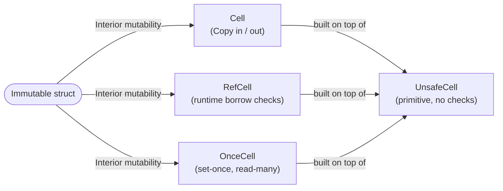

### 13.1 `Cell<T>` Advanced Usage
1. **Byte-level manipulation**  
   - Sometimes, `Cell<u8>` (or any `Cell<T>` for small `T: Copy`) can be used for bitflags or small counters with zero overhead. 
   - **Example**: 
     ```rust
     struct Flags {
         bits: std::cell::Cell<u8>,
     }

     impl Flags {
         fn set_flag(&self, mask: u8) {
             let old = self.bits.get();
             self.bits.set(old | mask);
         }
         fn clear_flag(&self, mask: u8) {
             let old = self.bits.get();
             self.bits.set(old & !mask);
         }
     }
     ```

2. **`Cell::swap`**  
   - You can easily exchange contents of two cells without requiring `&mut self`.
   - ```rust
     let c1 = Cell::new(10);
     let c2 = Cell::new(20);
     c1.swap(&c2);
     assert_eq!(c1.get(), 20);
     assert_eq!(c2.get(), 10);
     ```
   - Behind the scenes, it does a simple `mem::swap`.

3. **`Cell<T>` for small, `Copy` data**  
   - If `T` is large or not `Copy`, prefer `RefCell<T>` or another strategy to avoid excessive copying or partial moves.

---

### 13.2 `RefCell<T>` Advanced Usage

1. **Cloning a `RefCell<T>`**  
   - `RefCell<T>` implements `Clone` only if `T: Clone`. This clone operation borrows `self` immutably to read the data and create a new `RefCell<T>` with a fresh borrow state. 
   - If the original is **mutably** borrowed at the time, it **panics**.

2. **Borrow Count Overflow**  
   - In extremely rare cases (or malicious code), you can cause **borrow counters** to overflow by repeatedly creating references and forgetting them. This leads to panics. In normal usage, extremely unlikely.
   - Just be aware that `RefCell` uses an `isize` counter (theoretically can overflow if you do something pathological).

3. **Splitting Borrows** (`map_split`, `map`)  
   - If you have a `RefMut<T>`, you can split it into multiple `RefMut<U>` and `RefMut<V>` references to disjoint subfields by using `RefMut::map_split`. 
   - This is safe only if the function you provide actually splits the data into disjoint regions (e.g., two slices of a vector that don’t overlap).

4. **Filtering Borrows** (`filter_map`)  
   - If your borrowed data is optional or you only want part of it conditionally, you can use `Ref::filter_map` or `RefMut::filter_map`. If the closure returns `None`, the original borrow is returned in an `Err`.

5. **Leaking References**  
   - If you call `Ref::leak` or `RefMut::leak`, you turn that borrow reference into a `'static` reference, effectively telling the compiler "this will never be released."
   - This also means `RefCell` remains borrowed for the rest of the program lifetime. 
   - May be used in some advanced single-threaded scenarios, but typically is avoided because it's easy to trigger memory leaks or hamper future borrows.

---

### 13.3 `OnceCell<T>` Advanced Usage

1. **When do I need `OnceCell<T>`?**  
   - When you have data that’s **expensive** to compute and you only want to do it once, caching the result.  
   - When you must fill an otherwise immutable data structure in a two-phase initialization.

2. **`OnceCell::get_or_init`**  
   - The most common pattern to lazily initialize something:
     ```rust
     let val = my_once_cell.get_or_init(|| {
         // do some expensive computation
         99
     });
     assert_eq!(*val, 99);
     ```
   - The closure is only run once, subsequent calls will just return the same reference.

3. **Mutable Access**  
   - After setting, you can’t change it again without a *mutable reference to the entire `OnceCell<T>`*. 
   - This is different from `RefCell` which can be changed from just a shared reference. 
   - That’s how `OnceCell` ensures no repeated sets from multiple aliases.

4. **`once_cell` Crate**  
   - There used to be (and still is) a popular external crate called `once_cell` offering a more advanced `OnceCell` or `Lazy`. The std `OnceCell` is a simpler subset of that functionality.

---

### 13.4 `UnsafeCell<T>` Internals and Patterns

- **`UnsafeCell<T>`** is the **foundation** of interior mutability. 
- **All** `Cell`, `RefCell`, and `OnceCell` internally use `UnsafeCell<T>`.
- `UnsafeCell<T>` alone is **unsafe** to use directly because the compiler no longer enforces immutability invariants on the pointed-to data.

**Example** minimal re-implementation of a `Cell`:
```rust
use std::cell::UnsafeCell;

pub struct MyCell<T> {
    data: UnsafeCell<T>,
}

impl<T> MyCell<T> {
    pub fn new(v: T) -> Self {
        MyCell { data: UnsafeCell::new(v) }
    }

    pub fn set(&self, x: T) {
        unsafe {
            // We can write through the raw pointer
            *self.data.get() = x;
        }
    }

    pub fn get(&self) -> T 
    where T: Copy {
        unsafe {
            // We can read the data from the pointer
            *self.data.get()
        }
    }
}
```
- The **`unsafe`** parts are reading/writing `*self.data.get()` without borrow-checker enforcement.
- Library code ensures safety by restricting usage patterns (like requiring `T: Copy` for `get()`).

---

### 13.5 Visual Diagram



> **Legend**:
> - `Cell<T>`: Best for small, `Copy` types, no runtime overhead, but can’t take borrows.
> - `RefCell<T>`: More flexible, allows multiple imm/mut borrows with runtime checks.
> - `OnceCell<T>`: One-time set, subsequent immutable reads.
> - `UnsafeCell<T>`: The underlying mechanism, `!Sync`.

---

### 13.6 Common Anti-Patterns

1. **Using `Cell<T>` for large or non-`Copy` data**  
   - Could lead to performance issues due to many moves or partial overwrites.  
   - You can’t do partial modifications without rewriting the entire value.

2. **Too Many `RefCell` Borrow Panics**  
   - If your code frequently hits runtime panics due to `borrow_mut()`, it might indicate a design issue.  
   - Consider re-architecting the data flow or using a single-phase approach with unique borrows.

3. **Forgetting `RefMut`**  
   - If you do `mem::forget(ref_mut)`, you can artificially keep the `RefCell` in a borrowed state forever (leading to subsequent panics).  
   - Usually indicates questionable design.

4. **Using `OnceCell` for multi-writes**  
   - If you actually need multiple writes at runtime, use `RefCell` or a concurrency type if multi-threaded.

---

### 13.7 Summary and Best Practices

- **`Cell<T>`**:
  - Perfect for small or `Copy` data. 
  - No runtime checks, but you cannot take a direct reference to the inner data.

- **`RefCell<T>`**:
  - Provides dynamic (runtime) checking of Rust’s borrow rules.
  - Great in tandem with `Rc<T>`, `Arc<T>` (in single-thread contexts).
  - Panics if you violate borrow rules.

- **`OnceCell<T>`**:
  - Single assignment, potentially lazy initialization.
  - After set, you can read immutably many times without overhead.
  - Not suitable for re-assignments unless you have `&mut OnceCell<T>`.

- **`UnsafeCell<T>`**:
  - The raw low-level building block. Usually used in library or advanced code implementing custom interior mutability abstractions.

Keep in mind:
- They’re all **single-thread** only (non-`Sync`) unless using concurrency-specific wrappers (like `Mutex`, `RwLock`, or atomic types).
- **Interior mutability** is powerful but can lead to unexpected run-time panics or complexities if abused. Use **only** when the usual borrowing rules are truly insufficient.

```rust
// The typical pattern: Use RefCell if truly needed, avoid if possible
fn main() {
    let data = std::cell::RefCell::new(5);
    {
        let mut borrow = data.borrow_mut(); // mutable borrow
        *borrow += 1;
    }
    println!("Value is now: {}", data.borrow());
}
```

---

## 14. Final References

- **[Rust std::cell docs](https://doc.rust-lang.org/std/cell/)**
- **[The Rust Book: Interior Mutability](https://doc.rust-lang.org/book/ch15-05-interior-mutability.html)**
- **[Rust Reference & Nomicon for advanced `UnsafeCell` usage](https://doc.rust-lang.org/nomicon/)** 
- **[`once_cell` crate](https://crates.io/crates/once_cell)** offering more advanced features outside std
- **[Sync Primitives](https://doc.rust-lang.org/std/sync/index.html)** if you need concurrency

```