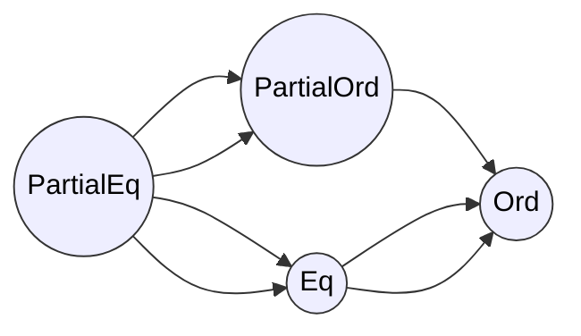

aliases: [Comparisons in Rust, Ordering, PartialEq, Eq, PartialOrd, Ord, Sorting]
tags: [rust, engineering, advanced, comparisons, ordering, sorting]

Rust provides a variety of **traits** for comparing and ordering values, notably:
- **`PartialEq`/`Eq`** for equality comparisons (`==`, `!=`).
- **`PartialOrd`/`Ord`** for ordering comparisons (`<`, `<=`, `>`, `>=`).
- **`Ordering`** (an enum) to represent the three outcomes of a comparison: **Less**, **Equal**, or **Greater**.
- Helpers like **`Reverse`** for reversing order, and **`min`/`max`** for taking minima or maxima.
---
## 1. **Background Concepts**
### 1.1 Partial vs. Total Equivalence
- **`PartialEq`**: Indicates that we can compare two values for equality (==, !=).
  - This is potentially **partial** because for some types (e.g., floating-point with `NaN`), not all values can form a well-defined equivalence relation for **all** pairs.
- **`Eq`**: Strengthens `PartialEq` to require a full **equivalence relation**, where every value is equal to itself (`a == a` always). Common for integral or discrete types.
### 1.2 Partial vs. Total Ordering
- **`PartialOrd`**: We can compare values, but some comparisons may fail to produce an ordering (e.g. `NaN` in floating point). 
  - This means `a < b`, `a > b`, etc., are well-defined only in some cases.
- **`Ord`**: A **total** ordering. For any two values `a` and `b`, exactly one of `(a < b)`, `(a == b)`, or `(a > b)` holds.
### 1.3 `Ordering` Enum
```rust
#[derive(Clone, Copy, PartialEq, Eq, Debug, Hash)]
pub enum Ordering {
    Less = -1,
    Equal = 0,
    Greater = 1,
}
```
Used by many comparison functions, signifying the outcome.

---
## 2. **`PartialEq` and `Eq`**

### 2.1 `PartialEq`

**Signature**:
```rust
trait PartialEq<Rhs = Self> {
    fn eq(&self, other: &Rhs) -> bool;
    fn ne(&self, other: &Rhs) -> bool { !self.eq(other) }
}
```
- By implementing `PartialEq<Rhs>`, you enable `==` and `!=` between types `Self` and `Rhs`.
- Must ensure **consistency**:
  - `!(a == b)` ↔ `(a != b)`
  - Symmetry and transitivity if the reverse impl or chain-of-impl exists.

**Common usage**:
```rust
#[derive(PartialEq)]
struct Point {
    x: i32,
    y: i32,
}

// eq => x == x and y == y, automatically derived.
```
**Manual** example:
```rust
enum BookFormat { Paperback, Hardback, Ebook }
struct Book { isbn: i32, format: BookFormat }

impl PartialEq for Book {
    fn eq(&self, other: &Self) -> bool {
        self.isbn == other.isbn
    }
}
```

### 2.2 `Eq`
**Signature**:
```rust
trait Eq: PartialEq<Self> { /* no extra methods */ }
```
- Indicates that equality is a **full equivalence**: reflexive, symmetric, transitive.
- Typically used for discrete types (integers, chars, etc.).
- `impl Eq` requires you already have a consistent `PartialEq`.

**Example**:
```rust
impl Eq for Book {}
```

---

## 3. **`PartialOrd` and `Ord`**

### 3.1 `PartialOrd`

**Signature**:
```rust
trait PartialOrd<Rhs = Self>: PartialEq<Rhs> {
    fn partial_cmp(&self, other: &Rhs) -> Option<Ordering>;
    fn lt(&self, other: &Rhs) -> bool { ... }
    fn le(&self, other: &Rhs) -> bool { ... }
    fn gt(&self, other: &Rhs) -> bool { ... }
    fn ge(&self, other: &Rhs) -> bool { ... }
}
```
- If `partial_cmp(a, b)` returns `None`, it means `a` and `b` are *not comparable* (e.g., `NaN` case).
- The default `lt`, `le`, `gt`, `ge` use `partial_cmp(...)`.

### 3.2 `Ord`

**Signature**:
```rust
trait Ord: Eq + PartialOrd<Self> {
    fn cmp(&self, other: &Self) -> Ordering;
    fn max(self, other: Self) -> Self { ... }
    fn min(self, other: Self) -> Self { ... }
    fn clamp(self, min: Self, max: Self) -> Self { ... }
}
```
- `cmp(a, b)` must return **Some(Ordering)** for every `a`, `b`.
- This is a **total** order: exactly one of `a < b`, `a == b`, `a > b`.

**Example**:
```rust
impl Ord for Book {
    fn cmp(&self, other: &Self) -> Ordering {
        self.isbn.cmp(&other.isbn)
    }
}
impl PartialOrd for Book {
    fn partial_cmp(&self, other: &Self) -> Option<Ordering> {
        Some(self.cmp(other))
    }
}
impl Eq for Book {}
impl PartialEq for Book {
    fn eq(&self, other: &Self) -> bool {
        self.isbn == other.isbn
    }
}
```
**All** these traits must be consistent:
- `a < b` → `b > a`
- `a == b` → `partial_cmp(a, b) == Some(Ordering::Equal)`.
- etc.

---

## 4. **Ordering Enum**

```rust
pub enum Ordering {
    Less,
    Equal,
    Greater,
}
```
**Methods**:
1. **`reverse()`**: flips `Less <-> Greater`, keeps `Equal` same.
2. **`then(...)`**: chain orderings, e.g. for multi-field sorting:
   ```rust
   let res = x.0.cmp(&y.0).then(x.1.cmp(&y.1));
   ```
3. **`is_eq()`, `is_lt()`, `is_gt()`, etc.**: convenience checks.

---

## 5. **Deriving vs. Manual Implementation**

- **#[derive(PartialEq, PartialOrd, Eq, Ord)]** can be placed on many types:
  - For `struct`s: does **lexicographic** ordering on fields in declaration order.
  - For `enum`s: orders by **discriminant** first, then fields if same variant.

**Example**:
```rust
#[derive(PartialEq, Eq, PartialOrd, Ord)]
struct Point(i32, i32);

// Compare first coordinate, if tie, compare second
```

**Manual** implementations are used when you only want to compare **some** fields or in a custom manner. Just be careful about the required **transitivity** & **consistency**.

---

## 6. **`Reverse<T>`**

**A struct** that flips the ordering:
```rust
#[derive(PartialEq, Eq, Debug, Clone, Hash)]
pub struct Reverse<T>(pub T);
```

- `Reverse(num).cmp(&Reverse(other_num))` is the same as `other_num.cmp(&num)`.
- Often used with sorting:
  ```rust
  let mut data = vec![1,3,2];
  data.sort_by_key(|&x| Reverse(x));
  assert_eq!(data, vec![3,2,1]);
  ```

---

## 7. **Helper Functions**: `min`, `max`, `clamp`, `min_by`, `max_by`, etc.

- **`cmp::min(a, b)`** / `cmp::max(a, b)`** (for `Ord` types)
- **`cmp::min_by(a, b, f)`** / `cmp::max_by(a, b, f)`** → use a custom comparator function
- **`cmp::min_by_key(a, b, f)`** / `cmp::max_by_key(a, b, f)`** → compares the results of `f`
- **`a.clamp(min, max)`** → restrict `a` to the inclusive range [`min`, `max`].
  - Panics if `min > max`.

**Examples**:
```rust
use std::cmp;

fn main() {
    assert_eq!(cmp::min(1, 2), 1);
    assert_eq!(cmp::max(1, 2), 2);

    let result = cmp::min_by(-2, 3, |x: &i32, y: &i32| x.abs().cmp(&y.abs()));
    assert_eq!(result, -2);

    assert_eq!(5.clamp(2, 6), 5);
    assert_eq!(10.clamp(2, 6), 6);
}
```

**(Nightly)** `minmax`, `minmax_by`, `minmax_by_key` return `[min, max]` in a single call.

---

## 8. **Practical Examples**

### 8.1 Sorting a Struct by Multiple Criteria

```rust
#[derive(Debug)]
struct Employee {
    name: String,
    age: u32,
    salary: u32,
}

// Sort employees by salary desc, then by age asc
impl PartialEq for Employee {
    fn eq(&self, other: &Self) -> bool {
        self.salary == other.salary && self.age == other.age
    }
}
impl Eq for Employee {}

impl PartialOrd for Employee {
    fn partial_cmp(&self, other: &Self) -> Option<std::cmp::Ordering> {
        Some(self.cmp(other))
    }
}
impl Ord for Employee {
    fn cmp(&self, other: &Self) -> std::cmp::Ordering {
        // primary compare: salary desc
        match other.salary.cmp(&self.salary) {
            std::cmp::Ordering::Equal => {
                // secondary compare: age asc
                self.age.cmp(&other.age)
            }
            x => x,
        }
    }
}

fn main() {
    let mut data = vec![
        Employee { name: "Alice".into(), age: 30, salary: 5000 },
        Employee { name: "Bob".into(),   age: 25, salary: 6000 },
        Employee { name: "Carol".into(), age: 25, salary: 6000 },
    ];
    data.sort(); // uses our Ord

    // Bob & Carol have same salary => compare age
    // Carol(25) vs Bob(25) => same => but they are eq, stable sort keeps original order
    println!("{:?}", data);
}
```

---

## 9. **Comparisons Between Different Types**

- `PartialEq` and `PartialOrd` can have **two** type parameters, e.g. `impl PartialEq<OtherType> for MyType`.
- Usually, you want consistent transitivity across all your cross-type comparisons. It's easy to break the logic if partial or incomplete.

**Example**:
```rust
#[derive(PartialEq)]
enum BookFormat { Paperback, Hardback, Ebook }

struct Book { isbn: i32, format: BookFormat }

// Compare Book to BookFormat
impl PartialEq<BookFormat> for Book {
    fn eq(&self, fmt: &BookFormat) -> bool {
        self.format == *fmt
    }
}
```
**But**: watch out for **transitivity** or you might break `==`.

---

## 10. **Key Takeaways**

1. **`PartialEq`, `Eq`, `PartialOrd`, `Ord`** traits let you define how your types compare for equality and ordering.
2. **Consistency** is crucial: do not break transitivity or reflexivity, or you get illogical results (though not UB in safe code, it’s still “logic error”).
3. **Derive** if your comparison is purely lexicographic on all fields; otherwise manually implement carefully.
4. Use **`Ordering`** to combine or chain multi-field or multi-step comparisons.
5. `Reverse<T>` is convenient for reversing order in sorting contexts.
6. Helpers: `min`, `max`, `clamp`, plus `*_by`, `*_by_key`.

---

## 11. **Diagram: Trait Hierarchy**



- **`Eq`** extends `PartialEq`.
- **`Ord`** extends `Eq` and `PartialOrd`.

---

## 12. **Conclusion**

Comparisons in Rust are flexible but must adhere to well-defined rules to avoid violating mathematical properties. By deriving or implementing these traits (`PartialEq`, `Eq`, `PartialOrd`, `Ord`) carefully, you can create robust sorting, searching, and equality-checking logic for custom types. The standard library also provides helpful utility functions and the `Ordering` enum to chain or invert comparison results.

**Further Reading**:
- [Rust Reference on `std::cmp` module](https://doc.rust-lang.org/std/cmp/index.html)
- [The Rust Book - Ch.5 (basic traits) and Ch.17 (trait usage)](https://doc.rust-lang.org/book/)
- [Rust Reference - Trait Implementation Rules](https://doc.rust-lang.org/reference/items/traits.html)
```