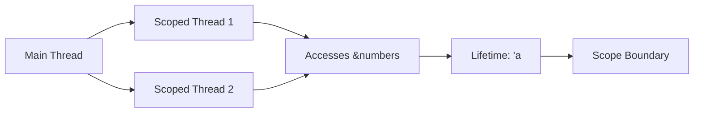

## Table of Contents
1. [Introduction](#introduction)
2. [Understanding Threads in Rust](#understanding-threads-in-rust)
3. [What Are Scoped Threads?](#what-are-scoped-threads)
4. [Advantages of Scoped Threads](#advantages-of-scoped-threads)
5. [Detailed Explanation of the Example](#detailed-explanation-of-the-example)
6. [Lifetimes and Borrowing in Scoped Threads](#lifetimes-and-borrowing-in-scoped-threads)
7. [Safety Guarantees](#safety-guarantees)
8. [Potential Pitfalls and Considerations](#potential-pitfalls-and-considerations)
9. [Advanced Usage and Patterns](#advanced-usage-and-patterns)
10. [Conclusion](#conclusion)
11. [References](#references)

---
## Introduction

Concurrency is a cornerstone of modern software engineering, enabling programs to perform multiple tasks simultaneously. Rust, known for its emphasis on safety and performance, offers robust concurrency primitives. Among these, **scoped threads** present a compelling approach to managing thread lifetimes and data sharing.

This guide delves deep into **scoped threads** in Rust, providing a logical and comprehensive explanation tailored for PhD-level engineers. We'll explore their mechanics, benefits, and practical applications, supplemented with examples and visual aids to solidify understanding.

---

## Understanding Threads in Rust

Before diving into scoped threads, it's essential to grasp how Rust handles threading in general.

### **Standard Threads**

Rust's standard threading model revolves around **OS-native threads**, managed through the `std::thread` module. Here's a quick overview:

- **Spawning Threads**: Use `thread::spawn` to create a new thread.

  ```rust
  use std::thread;

  fn main() {
      let handle = thread::spawn(|| {
          // Thread's work
          println!("Hello from the new thread!");
      });

      println!("Hello from the main thread!");
      handle.join().unwrap();
  }
  ```

- **Detached vs. Joinable Threads**:
  - **Detached**: Threads that are not joined; they run independently.
  - **Joinable**: Threads that are joined using `JoinHandle::join`, allowing the main thread to wait for their completion and retrieve their results.

### **Limitations of Standard Threads**
While powerful, standard threads come with certain constraints:

- **'static Lifetime Requirement**: The closure passed to `thread::spawn` must have a `'static` lifetime. This means the closure cannot borrow non-static references, restricting its ability to access data from the parent thread without ownership.
  ```rust
  use std::thread;

  fn main() {
      let numbers = vec![1, 2, 3];
      
      // This will **not compile** because `numbers` is borrowed
      let handle = thread::spawn(|| {
          println!("Length: {}", numbers.len());
      });
      
      handle.join().unwrap();
  }
  ```
- **Data Ownership**: To bypass the `'static` requirement, data must be moved into the thread, which can lead to ownership complexities, especially when multiple threads need access to shared data.

---
## What Are Scoped Threads?
**Scoped threads** provide a solution to the limitations of standard threads by allowing threads to borrow data from the parent thread. Introduced in Rust 1.63.0 under the `scoped_threads` feature, scoped threads enable safe data sharing without requiring `'static` lifetimes.

### **Key Characteristics**
- **Scoped Lifetimes**: Threads spawned within a scope cannot outlive that scope, ensuring that any borrowed data remains valid for the thread's duration.
- **Borrowing Data**: Unlike standard threads, scoped threads can borrow references to data in the parent thread, eliminating the need for ownership transfers or synchronization primitives for read-only access.
- **Automatic Joining**: The scope ensures that all spawned threads complete before exiting, implicitly joining them and handling any panics.
### **Syntax and Usage**
Scoped threads are created using the `thread::scope` function, which takes a closure that receives a scope handle (`&Scope`). This handle is used to spawn threads within the scope.

```rust
use std::thread;

fn main() {
    let numbers = vec![1, 2, 3];

    thread::scope(|s| {
        s.spawn(|| {
            println!("Length: {}", numbers.len());
        });
        s.spawn(|| {
            for n in &numbers {
                println!("{n}");
            }
        });
    });
}
```

---

## Advantages of Scoped Threads

Scoped threads offer several benefits over standard threads:
1. **Elimination of `'static` Constraints**: Allow threads to borrow data, reducing the need for ownership transfers or `Arc<Mutex<T>>` wrappers for read-only data.
2. **Enhanced Safety**: The compiler ensures that borrowed data remains valid for the duration of the threads, preventing dangling references and data races.
3. **Simplified Syntax**: Scoped threads enable more ergonomic code by allowing direct borrowing of parent thread data.
4. **Automatic Resource Management**: Scopes automatically join threads, ensuring that resources are cleaned up and panics are propagated appropriately.

---
## Detailed Explanation of the Example

Let's dissect the provided code to understand how scoped threads operate.

```rust
use std::thread;

fn main() {
    let numbers = vec![1, 2, 3];

    thread::scope(|s| {
        s.spawn(|| {
            println!("Length: {}", numbers.len());
        });
        s.spawn(|| {
            for n in &numbers {
                println!("{n}");
            }
        });
    });
}
```

### **Step-by-Step Breakdown**

1. **Importing the Thread Module**
   
   ```rust
   use std::thread;
   ```

   This brings the `std::thread` module into scope, providing access to threading functionalities.

2. **Defining the `main` Function**

   ```rust
   fn main() {
       // ...
   }
   ```

   The entry point of the Rust program.

3. **Creating Shared Data**

   ```rust
   let numbers = vec![1, 2, 3];
   ```

   A vector `numbers` is created, containing integers. This data is intended to be accessed by multiple threads.

4. **Creating a Scoped Thread Scope**
   ```rust
   thread::scope(|s| {
       // ...
   });
   ```

   The `thread::scope` function creates a new scope for spawning threads. It takes a closure with a scope handle `s`, which is used to spawn threads within this scope.

5. **Spawning the First Thread**
   ```rust
   s.spawn(|| {
       println!("Length: {}", numbers.len());
   });
   ```

   - **Closure**: The closure borrows `numbers` implicitly. Since it's within the scope, Rust ensures that `numbers` remains valid for the thread's lifetime.
   - **Output**: Prints the length of the `numbers` vector.

6. **Spawning the Second Thread**
   ```rust
   s.spawn(|| {
       for n in &numbers {
           println!("{n}");
       }
   });
   ```

   - **Closure**: Iterates over borrowed references to `numbers`, printing each number.
   - **Output**: Prints each number in the `numbers` vector.
7. **Scope Exit and Thread Joining**
   - Upon exiting the `thread::scope` closure, Rust ensures that all spawned threads within the scope have completed execution.
   - If any thread panicked, the panic is propagated to the main thread, potentially aborting the program.

### **Execution Flow**

1. The `numbers` vector is created in the main thread.
2. Two threads are spawned within the scope:
   - **Thread 1**: Prints the length of `numbers`.
   - **Thread 2**: Iterates over and prints each element in `numbers`.
3. The scope waits for both threads to finish before proceeding.
4. Since the threads are within the same scope and do not outlive it, there's no risk of dangling references or data races.

### **Expected Output**

```
Length: 3
1
2
3
```

*Note: The actual order might vary due to the concurrent nature of threads.*

---

## Lifetimes and Borrowing in Scoped Threads

### **Understanding Lifetimes**

Rust's ownership model is underpinned by **lifetimes**, which dictate how long references are valid. Scoped threads leverage lifetimes to ensure that threads do not outlive the data they borrow.

### **Scoped Threads and Lifetimes**

In the context of scoped threads:

- **Scope's Lifetime**: The closure passed to `thread::scope` defines a lifetime scope. All threads spawned within this closure must complete before the scope exits.
  
- **Borrowed References**: Threads can borrow references to data within the scope, as Rust ensures that the data outlives the threads.

### **Illustrative Example**

```rust
use std::thread;

fn main() {
    let message = String::from("Hello, Scoped Threads!");

    thread::scope(|s| {
        s.spawn(|| {
            println!("{}", message);
        });
    });

    // `message` can still be used here safely
    println!("Main thread: {}", message);
}
```

### **Explanation**

1. **Data Creation**: `message` is created in the main thread.
2. **Scoped Thread**: A thread is spawned within the scope, borrowing `message` by reference.
3. **Scope Enforcement**:
   - The thread must finish before the scope exits.
   - Ensures that `message` remains valid for the thread's duration.
4. **Post-Thread Usage**: After the scope, `message` is still accessible and valid.

### **Benefits**

- **Safety**: Prevents threads from accessing invalid or dropped data.
- **Flexibility**: Allows borrowing data without needing to transfer ownership or use synchronization primitives for immutable access.

---

## Safety Guarantees

Scoped threads in Rust provide robust safety guarantees, leveraging the compiler's ownership and lifetime checks.

### **1. No Dangling References**

By ensuring that threads cannot outlive the scope they are spawned in, Rust guarantees that any borrowed references remain valid throughout the thread's execution.

### **2. Data Race Prevention**

Rust's borrowing rules inherently prevent data races. Scoped threads can borrow data immutably or mutably, but the compiler ensures that mutable borrows are exclusive, eliminating concurrent write conflicts.

### **3. Panic Safety**

If a thread within a scope panics, Rust ensures that the panic is propagated appropriately, maintaining the program's integrity.

### **4. Automatic Joining**

Scoped threads are automatically joined when the scope exits. This ensures that all threads have completed, preventing orphaned threads and resource leaks.

---

## Potential Pitfalls and Considerations

While scoped threads enhance safety and ergonomics, there are considerations to keep in mind:

### **1. Limited to Scope Lifetime**

Threads cannot outlive the scope they are spawned in. Attempting to spawn threads that need to run independently (detached) requires using standard threads outside of `thread::scope`.

### **2. Compiler Support**

Scoped threads rely on Rust's lifetime and borrowing system. Complex borrowing scenarios may require explicit lifetime annotations or restructuring code to fit within scope constraints.

### **3. Performance Overhead**

While minimal, there might be slight performance overhead due to lifetime checks and ensuring threads complete within the scope.

### **4. Nested Scopes**

Spawning threads within nested scopes can lead to intricate lifetime hierarchies, potentially complicating the codebase.

---

## Advanced Usage and Patterns

### **1. Scoped Threads with Mutable Borrows**

Scoped threads can safely mutate shared data using mutable references, provided that Rust's borrowing rules are adhered to.

```rust
use std::thread;

fn main() {
    let mut data = vec![1, 2, 3];

    thread::scope(|s| {
        s.spawn(|| {
            data.push(4);
            println!("Added 4 to data");
        });
        s.spawn(|| {
            data.push(5);
            println!("Added 5 to data");
        });
    });

    println!("Final data: {:?}", data);
}
```

**Output:**
```
Added 4 to data
Added 5 to data
Final data: [1, 2, 3, 4, 5]
```

### **2. Using `Arc` and `Mutex` within Scoped Threads**

For scenarios requiring shared ownership and mutable access across multiple threads, combining `Arc` (Atomic Reference Counting) with `Mutex` (Mutual Exclusion) is effective.

```rust
use std::sync::{Arc, Mutex};
use std::thread;

fn main() {
    let data = Arc::new(Mutex::new(vec![1, 2, 3]));

    thread::scope(|s| {
        for _ in 0..3 {
            let data_clone = Arc::clone(&data);
            s.spawn(move || {
                let mut vec = data_clone.lock().unwrap();
                vec.push(4);
                println!("Appended 4");
            });
        }
    });

    println!("Final data: {:?}", data.lock().unwrap());
}
```

**Output:**
```
Appended 4
Appended 4
Appended 4
Final data: [1, 2, 3, 4, 4, 4]
```

### **3. Handling Panics within Scoped Threads**

Scoped threads propagate panics to the parent scope, allowing for centralized error handling.

```rust
use std::thread;

fn main() {
    let result = thread::scope(|s| {
        s.spawn(|| {
            panic!("Thread panicked!");
        });
    });

    match result {
        Ok(_) => println!("All threads completed successfully."),
        Err(e) => println!("A thread panicked: {:?}", e),
    }
}
```

**Output:**
```
A thread panicked: Any
```

---

## Practical Examples

### **Example 1: Parallel Computation**

Compute the sum and product of a list of numbers in parallel using scoped threads.

```rust
use std::thread;

fn main() {
    let numbers = vec![1, 2, 3, 4, 5];

    let (sum, product) = thread::scope(|s| {
        let sum_handle = s.spawn(|| {
            numbers.iter().sum::<i32>()
        });
        let product_handle = s.spawn(|| {
            numbers.iter().product::<i32>()
        });

        (sum_handle.join().unwrap(), product_handle.join().unwrap())
    });

    println!("Sum: {}, Product: {}", sum, product);
}
```

**Output:**
```
Sum: 15, Product: 120
```

### **Example 2: Scoped Threads with Early Scope Exit**

Attempting to use scoped threads outside their scope results in compile-time errors, ensuring safety.

```rust
use std::thread;

fn main() {
    let data = vec![1, 2, 3];

    let handle = thread::spawn(|| {
        println!("Data length: {}", data.len());
    });

    // Compile-time Error:
    // `data` does not live long enough
}
```

**Error Message:**
```
error[E0597]: `data` does not live long enough
  --> src/main.rs:6:35
   |
6  |         println!("Data length: {}", data.len());
   |                                   ^^^^ borrowed value does not live long enough
...
10 | }
   | - `data` dropped here while still borrowed
```

*Note: This error highlights the safety enforced by Rust's threading model.*

---

## Lifetimes and Borrowing in Scoped Threads

### **Rust's Lifetime System**

Rust's **lifetime system** ensures that references are valid for as long as they are used, preventing dangling references and data races. Scoped threads leverage this system to allow threads to borrow data safely.

### **How Scoped Threads Utilize Lifetimes**

In scoped threads:

- **Thread Lifetimes**: Threads are confined within a scope, ensuring they cannot outlive the data they borrow.
  
- **Borrowed References**: Threads can borrow data immutably or mutably, with the compiler guaranteeing the data remains valid.

### **Visual Representation**



- **`numbers`** has lifetime `'a`, confined within the scope.
- **Scoped Threads** borrow `numbers` and cannot outlive `'a`.

### **Code Example with Lifetimes**

```rust
use std::thread;

fn main() {
    let data = vec![10, 20, 30];

    thread::scope(|s| {
        s.spawn(|| {
            println!("Data: {:?}", data);
        });
        s.spawn(|| {
            let sum: i32 = data.iter().sum();
            println!("Sum: {}", sum);
        });
    });

    // `data` can still be used here safely
    println!("Data is still accessible: {:?}", data);
}
```

**Output:**
```
Data: [10, 20, 30]
Sum: 60
Data is still accessible: [10, 20, 30]
```

### **Explanation**

1. **Data Borrowing**: Both threads borrow `data` immutably.
2. **Lifetime Enforcement**: The scope ensures that `data` remains valid until both threads complete.
3. **No Dangling References**: Threads cannot outlive the scope, preventing access to invalid data.

---

## Safety Guarantees

Scoped threads in Rust provide stringent safety guarantees by intertwining the lifetime system with thread management.

### **1. Compile-Time Safety**

Rust's compiler enforces that:

- **Data Borrowed by Threads**: Must live at least as long as the threads.
  
- **No Data Races**: Concurrent mutable access is prevented through Rust's borrowing rules.

### **2. Automatic Thread Joining**

Upon exiting the scope, Rust automatically joins all spawned threads. This ensures:

- **Resource Cleanup**: Threads complete their execution, releasing resources.
  
- **Panic Propagation**: If any thread panics, the panic is propagated to the parent scope, allowing for centralized error handling.

### **3. No Dangling References**

Threads cannot access data outside their scope, eliminating the possibility of dangling references or accessing freed memory.

### **4. Memory Safety Without Garbage Collection**

Scoped threads maintain Rust's memory safety guarantees without relying on garbage collection, thanks to explicit lifetime management.

---

## Potential Pitfalls and Considerations

While scoped threads enhance safety and ergonomics, developers should be aware of certain considerations:

### **1. Scope Constraints**

- **Thread Lifetimes**: Threads must complete within the scope. Long-running or infinite threads are unsuitable for scoped threads.
  
- **Complex Borrowing**: Borrowing complex data structures may lead to intricate lifetime relationships, necessitating careful design.

### **2. Panics Within Threads**

- **Panic Propagation**: A panic in any scoped thread propagates to the parent scope, potentially aborting the entire scope.
  
- **Graceful Handling**: Implement error handling within threads to manage panics gracefully, preventing cascading failures.

### **3. Nested Scopes**

- **Multiple Levels**: Using nested `thread::scope` calls can complicate lifetime hierarchies and thread management.
  
- **Design Complexity**: Ensure that nested scopes are logically structured to maintain clarity and safety.

### **4. Limited to Current Edition**

Scoped threads are stabilized in Rust 1.63.0 and later. Ensure that your project uses a compatible Rust edition.

---

## Advanced Usage and Patterns

### **1. Borrowing Mutable References**

Scoped threads can borrow mutable references, enabling concurrent mutations under Rust's ownership rules.

```rust
use std::thread;

fn main() {
    let mut data = vec![1, 2, 3];

    thread::scope(|s| {
        s.spawn(|| {
            data.push(4);
            println!("Appended 4");
        });
        s.spawn(|| {
            data.push(5);
            println!("Appended 5");
        });
    });

    println!("Final data: {:?}", data);
}
```

**Output:**
```
Appended 4
Appended 5
Final data: [1, 2, 3, 4, 5]
```

### **2. Using `Arc` for Shared Ownership**

For scenarios where multiple threads need shared ownership of data, combine `Arc` with scoped threads.

```rust
use std::sync::Arc;
use std::thread;

fn main() {
    let data = Arc::new(vec![100, 200, 300]);

    thread::scope(|s| {
        for _ in 0..3 {
            let data_clone = Arc::clone(&data);
            s.spawn(move || {
                println!("Data: {:?}", data_clone);
            });
        }
    });
}
```

**Output:**
```
Data: [100, 200, 300]
Data: [100, 200, 300]
Data: [100, 200, 300]
```

### **3. Handling Panics Gracefully**

Implementing error handling within threads ensures that panics do not crash the entire application.

```rust
use std::thread;

fn main() {
    let result = thread::scope(|s| {
        let handle = s.spawn(|| {
            panic!("Thread encountered an error!");
        });
        handle.join()
    });

    match result {
        Ok(_) => println!("Thread completed successfully."),
        Err(e) => println!("Thread panicked: {:?}", e),
    }
}
```

**Output:**
```
Thread panicked: Any
```

### **4. Nested Scoped Threads**

Implementing nested scopes can manage complex threading hierarchies, though it requires careful lifetime management.

```rust
use std::thread;

fn main() {
    thread::scope(|s_outer| {
        s_outer.spawn(|| {
            let numbers = vec![10, 20, 30];
            thread::scope(|s_inner| {
                s_inner.spawn(|| {
                    println!("Numbers length: {}", numbers.len());
                });
                s_inner.spawn(|| {
                    for n in &numbers {
                        println!("{n}");
                    }
                });
            });
        });
    });
}
```

**Output:**
```
Numbers length: 3
10
20
30
```

---

## Conclusion

**Scoped threads** in Rust represent a powerful tool for concurrent programming, offering enhanced safety and ergonomics by integrating deeply with Rust's ownership and lifetime systems. They allow threads to borrow data from their parent scope, ensuring that data remains valid for the thread's duration and preventing common concurrency pitfalls such as data races and dangling references.

For PhD-level engineers delving into Rust's concurrency paradigms, understanding scoped threads is pivotal. They not only simplify thread management but also embody Rust's commitment to memory safety and performance. By leveraging scoped threads, developers can write more expressive, safe, and efficient concurrent code, harnessing the full potential of Rust's advanced features.

---

## References

1. [Rust Documentation: The `thread` Module](https://doc.rust-lang.org/std/thread/)
2. [Rust Book: Fearless Concurrency](https://doc.rust-lang.org/book/ch16-00-concurrency.html)
3. [Rust RFC: Scoped Threads](https://github.com/rust-lang/rfcs/blob/master/text/2997-scoped-threads.md)
4. [Rust Nomicon: Concurrency](https://doc.rust-lang.org/nomicon/threads.html)
5. [Understanding Lifetimes in Rust](https://doc.rust-lang.org/book/ch10-03-lifetime-syntax.html)
6. [Concurrency in Rust](https://rust-lang.github.io/async-book/01_getting_started/01_chapter.html)

---
```