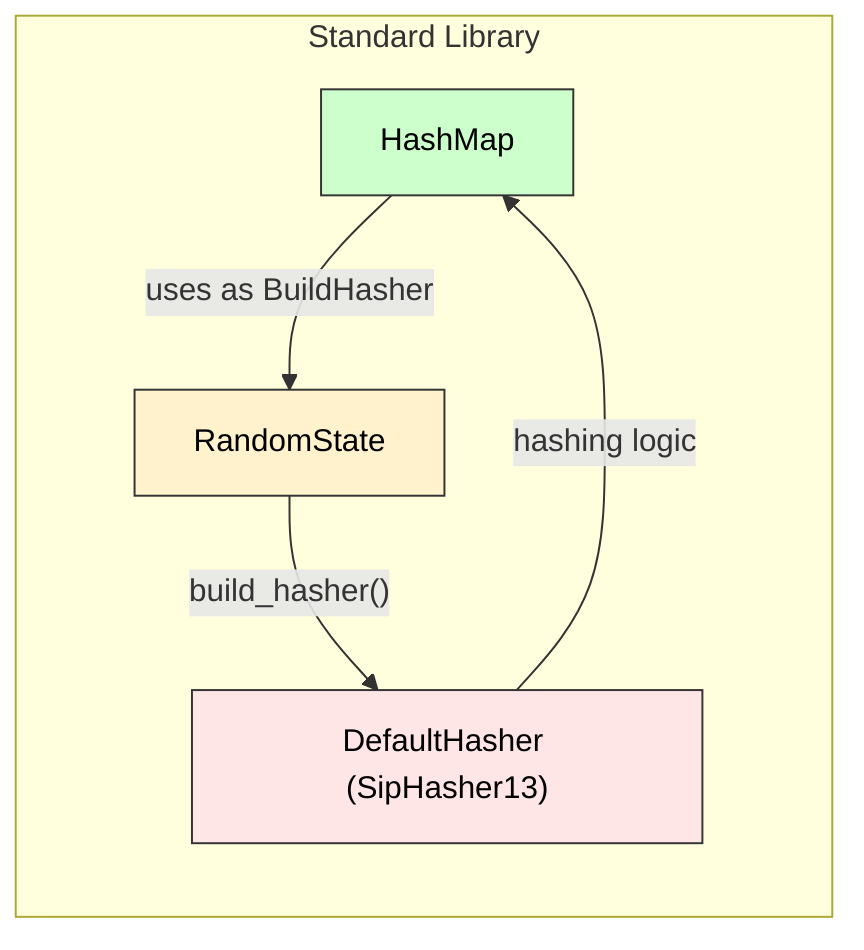

aliases: [Hashing, HashMap, Default Hasher, RandomState, SipHash, SipHasher13]
tags: [rust, engineering, advanced, hashing, random, ephemeral]

When you create a standard library **[`HashMap<K,V>`](https://doc.rust-lang.org/std/collections/struct.HashMap.html)** without specifying a custom hasher, Rust uses an internal *default* hasher. This note explains how **`RandomState`** (the default [`BuildHasher`]) and **`DefaultHasher`** are structured in Rust, including some internal details.

> **Important**: The algorithm used by the default hasher is an implementation detail. **Do not** rely on its specifics for **persisted** or **stable** hashing across Rust versions.
---
## 1. **Overview**
- **`RandomState`** is the default [build hasher](https://doc.rust-lang.org/std/hash/trait.BuildHasher.html) for Rust’s `HashMap`.
- It produces `DefaultHasher` instances when building hashers.
- `DefaultHasher` is currently based on **SipHash (SipHasher13)**, but the exact algorithm can change in the future.
- Each `RandomState` has **two u64 keys** (`k0`, `k1`) that randomize the hashing to help prevent certain DoS attacks based on collisions.
---
## 2. **`RandomState` Details**
```rust
#[derive(Clone)]
pub struct RandomState {
    k0: u64,
    k1: u64,
}
```
### 2.1 Generation of Random Keys
- `RandomState::new()` obtains two random 64-bit keys. 
- These keys come from OS randomness (via `sys::hashmap_random_keys()`) at least once **per thread**. 
- Then, each thread **caches** them to avoid too many OS calls.
- With **each** new `RandomState`, Rust **increments `k0`** to ensure different iteration orders for each new HashMap created in the same thread. This helps avoid that accidental consistent iteration order might be exploited for collision-based DoS.
### 2.2 Purpose
1. Provide **hash randomization** to protect against malicious collision attacks. 
2. Keep an ephemeral internal state so that different `RandomState`s produce different `Hashe`s results.
**Use Case**:
```rust
use std::collections::HashMap;
use std::hash::RandomState;

let random_state = RandomState::new();
let mut map = HashMap::with_hasher(random_state);
map.insert("foo", 42);
```
---
## 3. **`DefaultHasher`**

```rust
#[derive(Clone, Debug)]
pub struct DefaultHasher(SipHasher13);
```

- **`DefaultHasher`** is an **alias** around an internal `SipHasher13`.
- You rarely instantiate `DefaultHasher` manually. Instead, `HashMap` does this behind-the-scenes when it calls `build_hasher()` on the `RandomState`.
- The "13" in `SipHasher13` refers to certain constants in the **SipHash** algorithm (1 & 3 round permutations).

### 3.1 Implementing `Hasher`:

```rust
impl Hasher for DefaultHasher {
    fn write(&mut self, msg: &[u8]) { self.0.write(msg) }
    fn write_str(&mut self, s: &str) { self.0.write_str(s); }
    fn finish(&self) -> u64 { self.0.finish() }
}
```

- Just forwards calls to the underlying `SipHasher13`.
- `finish()` returns a `u64` final hash result.

### 3.2 Construction

```rust
impl Default for DefaultHasher {
    fn default() -> Self {
        DefaultHasher::new()
    }
}

impl DefaultHasher {
    pub const fn new() -> DefaultHasher {
        // SipHasher13 with keys = (0,0) by default
        DefaultHasher(SipHasher13::new_with_keys(0, 0))
    }
}
```
- Note that this zero-key variant is used *only* if you construct `DefaultHasher` explicitly. In normal `HashMap` usage, you'll get your keys from `RandomState`.
---
## 4. **Thread-Local Caching**
**Inside** `RandomState::new()`:
```rust
thread_local!(static KEYS: Cell<(u64, u64)> = {
    // obtains random keys from the OS once per thread
    Cell::new(sys::hashmap_random_keys())
});

KEYS.with(|keys| {
    let (k0, k1) = keys.get();
    // increment k0 to ensure difference
    keys.set((k0.wrapping_add(1), k1));
    RandomState { k0, k1 }
});
```
- This ensures **no excessive OS calls**.
- Ensures each new `RandomState` on the same thread has a slightly different `k0`.
---
## 5. **Why SipHash?**
Rust uses a **high-quality** hashing function to:
1. Mitigate collision-based DoS.
2. Provide good distribution across common key types.
3. SipHash is a *cryptographic* hashing function designed for *short* inputs. It's relatively efficient for small data (like typical keys: small strings, integers, etc.).
4. The name `SipHasher13` indicates the variant with 1 compression round and 3 finalization rounds (a standard approach in the Rust implementation).
---
## 6. **How `RandomState` Connects to `DefaultHasher`**

- `RandomState` implements `BuildHasher`, meaning it can construct a new `Hasher`:
  ```rust
  fn build_hasher(&self) -> DefaultHasher {
      DefaultHasher(SipHasher13::new_with_keys(self.k0, self.k1))
  }
  ```
- So each time a `HashMap` needs to create a hasher (for a new item insertion, etc.), it calls `build_hasher`, receiving a `DefaultHasher` seeded with `(k0, k1)` from the `RandomState`.

---

## 7. **Stability & Usage Notes**

1. **Implementation Not Stable**:
   - The standard library explicitly states the internal algorithm can change from release to release. 
   - **Never** rely on the exact numeric hash values across different Rust versions for persisting or hashing-based structures (like databases).
2. **Security**:
   - The randomization is intended to reduce certain collision attacks. 
   - If you need a fully *cryptographically secure* hasher, you might consider external crates or a custom `BuildHasher` (like `blake3` or `sha2`).
3. **Performance**:
   - For large or custom data, consider implementing your own hasher if needed. 
   - But typically, `RandomState` is a good default.
---
## 8. **Diagram: Relationship to `HashMap`**


**Flow**:
1. `HashMap` has a `BuildHasher` = `RandomState`.
2. Each insertion triggers `RandomState.build_hasher()`, returning a new `DefaultHasher`.
3. `DefaultHasher` (SipHash) processes the key’s bytes, producing a `u64` for the bucket index.

---

## 9. **Key Takeaways**

1. **`RandomState`** → The default random keys for hashing in `HashMap`.
2. **`DefaultHasher`** → The hasher used by default when you rely on `RandomState`.
3. Uses **SipHash** internally, but that’s **not guaranteed**. 
4. A thread-local approach ensures random seeds for each thread, reusing them to avoid performance overhead from frequent random calls.
5. If you need a custom or different hasher, you can pass your own `BuildHasher` to `HashMap`.

---

## 10. **Code Examples**

### 10.1 Building a `HashMap` with `RandomState`
```rust
use std::collections::HashMap;
use std::hash::RandomState;

fn main() {
    let s = RandomState::new();
    let mut map: HashMap<&str, i32> = HashMap::with_hasher(s);
    map.insert("hello", 10);
    map.insert("world", 20);
    println!("{:?}", map);
}
```

### 10.2 Using `DefaultHasher` Directly
```rust
use std::hash::{Hash, Hasher, DefaultHasher};

fn main() {
    let mut hasher = DefaultHasher::new();
    let s = "example";
    s.hash(&mut hasher);
    let h = hasher.finish();
    println!("Hash is {}", h);
}
```
> Typically done for debug or testing. Real usage often delegates to the map.

---

**Further Reading**:
- [Rust `std::hash` documentation](https://doc.rust-lang.org/std/hash/index.html)
- [SipHash paper and references](https://131002.net/siphash/)
- [Why Rust changed from SipHash2-4 to SipHash1-3 in older versions (performance vs. security tradeoff)](https://internals.rust-lang.org/t/siphash13-default/).

```