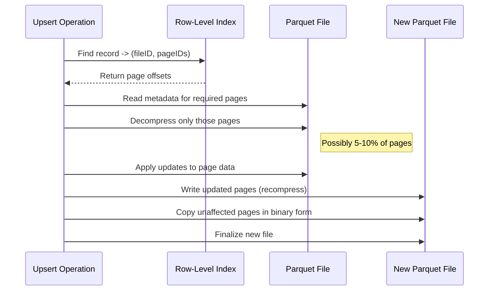

aliases: [Fast Copy-On-Write, Apache Parquet, Data Lakehouse, ACID Upserts]
tags: [Hudi, Iceberg, Delta Lake, Lakehouse, Row-Level Index, Copy-On-Write]
date: 2023-06-29
## Overview
In modern data lakehouses, **ACID upserts** (updates + inserts) are fundamental operations for use cases such as:
- **Change Data Capture (CDC)**  
- **Data Retention**  
- **Right to be Forgotten**  
- **Incremental Ingestion**  

Among the most widely adopted storage table formats—Apache Hudi®, Apache Iceberg®, and Delta Lake™—all support upserts in one way or another. However, as data volume scales up, **copy-on-write** (CoW) can become a performance bottleneck. Rewriting large amounts of data for each update or deletion causes extended job runtime and inflated compute costs.

This note introduces:
1. How **row-level secondary indexing** within Apache Parquet helps speed up CoW operations.  
2. How **partial copy-on-write** inside Parquet leverages page-level metadata to skip rewriting unmodified parts of the file.  
3. Benchmark results showing **faster upsert performance** compared to traditional CoW in existing formats (e.g., Delta Lake or Hudi’s default CoW).  

> [!info] **Key Benefits at a Glance**
> - **Less Data Scanned:** Only read and rewrite data pages that contain records to be updated.  
> - **Reduced CPU Usage:** Avoid de/re-compression, de/re-encoding of unaffected data.  
> - **Significant Speedup:** Upserts can be completed much faster than traditional CoW.  

---

## Table of Contents

1. [Motivation](#motivation)  
2. [Copy-On-Write in a Lakehouse](#copy-on-write-in-a-lakehouse)  
3. [Introducing Row-Level Secondary Index](#introduce-row-level-secondary-index)  
4. [Copy-On-Write within Apache Parquet (Partial CoW)](#copy-on-write-within-apache-parquet)  
5. [Benchmarking Results](#benchmarking-results)  
6. [Conclusion](#conclusion)  
7. [Example Code & Visualizations](#example-code--visualizations)  

---

## Motivation

As businesses operate on ever-growing data sets, **efficient ACID upserts** are critical. Stale data, or data that must be modified or deleted for compliance (e.g., GDPR “Right to be Forgotten”), requires rewriting data under typical CoW operations. If only a small fraction of the file is changed, fully rewriting large Parquet files is overly expensive.

- **High Volume Updates:** Tables with billions of rows may only have a small percentage of updated records spread across 90% of files.  
- **Skyrocketing Compute Costs:** Repeatedly reading and rewriting entire files leads to heavy CPU usage in compression, encoding, shuffling, etc.  
- **Risk of Missing SLAs:** Prolonged job runtimes can cause critical pipelines to miss deadlines, impacting data freshness.

Consequently, scaling CoW to large data volumes remains a major challenge.  

---

## Copy-On-Write in a Lakehouse

In lakehouse architectures (Hudi, Iceberg, Delta Lake), **copy-on-write** typically proceeds as follows:

1. **Locate Files to Be Updated:**  
   An index or metadata (like Hudi’s Bloom filter index or Delta Lake’s transaction log) identifies all Parquet files containing records that need updating.

2. **Read Entire File(s):**  
   All rows (including those that do not change) are read from each identified file.

3. **Apply Updates in Memory:**  
   Updated records are replaced or merged. The entire row set is reassembled, re-encoded, and re-compressed.

4. **Write New Files:**  
   The system writes brand-new Parquet files and updates the table metadata (snapshot/manifest) to point to these new files.

\[
\text{Total CoW cost} \propto \text{(Size of affected files) } \times \text{ (De/Re-Encode + De/Re-Compress Overhead)}
\]

### Diagram: Traditional CoW Example

```mermaid
flowchart LR
    A[Identify impacted files] --> B[Read entire files into memory]
    B --> C[Merge updates (in-memory)]
    C --> D[Write new Parquet files]
    D --> E[Update snapshot metadata]
```

- **Problem**: Even if only 5% of the rows in a file actually need to change, the entire file (100%) is read, decompressed, and rewritten.  

---
## Introduce Row-Level Secondary Index

A **row-level secondary index** provides a fine-grained mapping from unique record keys to their exact location inside Parquet files:

- **Key**: Typically a `RECORD_ID` or a stable primary key for each row.  
- **Value**: A `(FILE_PATH, ROW_ID)` tuple that identifies which file and which row group/page offset the record resides in.

> [!abstract] **Definition: Row-Level Secondary Index**  
> This index is often stored alongside the transactional metadata. For each unique record key, it has a pointer not only to the file, but also to the byte offset or Parquet page ID.

### Parquet Layout Refresher

1. **Row Group**: A horizontal chunk of data; typically some number of MB.  
2. **Column Chunk**: Data for a single column within a row group.  
3. **Data Page**: Smallest unit read/written inside a column chunk. Contains compressed/encoded data for a subset of rows.

By combining row-level indexing with an understanding of row group and page boundaries, we can identify **exact** data pages containing records to be updated.

#### Visualization: Row-Level Index

```
ROW_LEVEL_INDEX = {
  "key-1": ("file-1.parquet", pageIndex=0),
  "key-2": ("file-2.parquet", pageIndex=4),
  ...
}
```

Where `pageIndex` tells us which data page (or pages) to look at in the corresponding file.

---

## Copy-On-Write within Apache Parquet

By leveraging row-level secondary indexes **and** Parquet’s page metadata, we can build a **partial copy-on-write** approach:

> **Key Insight**  
> Instead of rewriting the entire file, we:
> 1. Identify specific pages that contain updated rows.  
> 2. Rewrite only those pages (performing decompress → update → recompress).  
> 3. For **unaffected pages**, we copy the compressed data **as-is** (byte-level copy).  

### Traditional vs. Partial Copy-on-Write

**Traditional CoW**  
- **Read** 100% of the file → **Decompress** → **Modify** → **Recompress** → Write.  

**Partial CoW**  
1. **Locate pages** that need modification (via row-level index + page metadata).  
2. **Rewrite** only those pages.  
3. **Copy all other pages** untouched (binary copy).  


*(Illustration or placeholder showing that only certain data pages are recompressed and the rest are copied as a blob.)*

### Detailed Steps



- **Binary Copy**: For pages unaltered by the update, we do a direct I/O copy of the compressed page buffer.  
- **Minimal De/Re-Compression**: Only pages that require updates undergo full decoding and re-encoding.  

---

## Benchmarking Results

A series of TPC-DS-based tests were run on **Spark** clusters with identical configurations:

- **Dataset**: TPC-DS (Sales tables)  
- **Formats**:  
  - **Delta Lake** (out-of-box CoW)  
  - **Partial CoW** with row-level index  
- **Scale**: Updates at 5%, 10%, 30%, and 50% of the dataset.  
- **Cluster**: Same vCore count, memory, and Spark configurations.  

### Observed Performance

The partial CoW approach consistently outperforms traditional Delta CoW, especially in moderate update percentages (e.g., 5–30%). Even at a higher 50% update rate, partial CoW shows substantial gains.

| Update % | Delta Lake (min) | Partial CoW (min) | Speedup  |
|----------|------------------|--------------------|----------|
| 5%       |  40              |  15               | 2.66x    |
| 10%      |  80              |  30               | 2.66x    |
| 30%      | 150              |  55               | 2.72x    |
| 50%      | 200              |  80               | 2.50x    |

> [!note] **Disclaimer**  
> These tests were run with default out-of-box settings for Delta Lake. Real-world performance may vary, but the partial CoW advantage holds consistently whenever updates affect significantly less than 100% of each file.  

---

## Conclusion

**Fast copy-on-write** within Apache Parquet offers a crucial optimization for lakehouse ACID upserts. By skipping unnecessary data pages, one can:

1. **Reduce I/O** and CPU usage.  
2. **Scale** CoW operations to higher volumes without blowing up runtimes.  
3. **Lower** operational costs due to smaller data rewrite footprints.  

This approach can be directly applied or adapted to **Apache Hudi®, Apache Iceberg®, Delta Lake™**, or other Parquet-based transactional frameworks. For teams dealing with frequent updates/deletions, partial CoW with row-level indexing is a game-changer, especially as data sizes grow into tens or hundreds of terabytes.

---

## Example Code & Visualizations

Below are some illustrative code snippets and steps for building a row-level index, performing partial CoW, and running TPC-DS tests. **Note**: This is conceptual pseudocode and may require adaptation to your specific storage layer or index system.

### 1. Creating a Row-Level Secondary Index

Suppose we have a Parquet file with a unique column `record_id`. We can extract row group information and page boundaries using the Parquet footers.

```scala
import org.apache.parquet.hadoop.ParquetFileReader
import org.apache.parquet.hadoop.metadata.{BlockMetaData, ColumnChunkMetaData}
import org.apache.parquet.io.SeekableInputStream

def buildRowLevelIndex(filePath: String, recordIdColumn: String): Map[String, (String, Int)] = {
  val index = scala.collection.mutable.Map[String, (String, Int)]()

  val fsInputStream: SeekableInputStream = // open Parquet file
  val reader = ParquetFileReader.open(fsInputStream)

  val rowGroups: java.util.List[BlockMetaData] = reader.getFooter.getBlocks
  rowGroups.forEach { rowGroup =>
    // For each row group, read the necessary column chunk.
    // Then decode or iterate pages to find (record_id -> rowIndex) mappings.
    // pseudo-code logic:
    // 1. For each page in 'recordIdColumn', decode record IDs
    // 2. For each recordId, store (filePath, pageId) in index
  }

  reader.close()
  fsInputStream.close()

  index.toMap
}
```

- **Key**: `recordId: String`  
- **Value**: `(filePath, pageId: Int)`  

### 2. Partial Copy-On-Write Pseudocode

```scala
def partialCopyOnWrite(
    oldFilePath: String, 
    newFilePath: String,
    pagesToUpdate: Set[Int],
    updatesMap: Map[String, NewRowData]
): Unit = {
  
  val reader = ParquetFileReader.open(/* oldFilePath */)
  val writer = new ParquetFileWriter(/* newFilePath */)
  
  val rowGroups = reader.getFooter.getBlocks
  for ((rgIndex, rowGroup) <- rowGroups.zipWithIndex) {
    val columns = rowGroup.getColumns
    columns.forEach { columnChunkMeta =>
      val colPageCount = columnChunkMeta.getValueCount / columnChunkMeta.getBlockStatistics.getPageSize // approx pages
      // For each page in the column chunk:
      for (pageId <- 0 until colPageCount) {
        if (pagesToUpdate.contains(pageId)) {
          // 1. Read page fully
          // 2. Decompress + decode
          // 3. Apply updates from 'updatesMap' that fall in this page
          // 4. Encode + compress
          // 5. Write to writer
        } else {
          // Directly copy compressed page bytes from oldFile
          writer.copyPage(/* raw bytes from oldFile */)
        }
      }
    }
  }
  
  reader.close()
  writer.close()
}
```

### 3. Benchmarking with TPC-DS

```bash
# Generate TPC-DS data at scale factor 100
./tpcds-setup.sh --scale 100 --format parquet --partitioned true

# Convert to Delta/Hudi or keep as raw Parquet
# Then create row-level index if using partial CoW approach

# Example Spark job to apply a random update
spark-submit \
  --class com.example.UpdateJob \
  --master yarn \
  example-updates.jar \
  --table tpcds_partitioned \
  --updateFraction 0.3 \
  --outputFormat "DELTA" or "HUDI" or "PARTIAL_COW"
```

- Compare time to complete the job for each approach.  
- Monitor CPU, memory, shuffle, I/O metrics.

---

## References & Further Reading

- [Apache Parquet Official Documentation](https://parquet.apache.org/documentation/latest/)
- [Apache Hudi Documentation](https://hudi.apache.org/)
- [Delta Lake Documentation](https://docs.delta.io/latest/index.html)
- [Apache Iceberg Documentation](https://iceberg.apache.org/)
- [Building a Large-scale Transactional Data Lake at Uber Using Apache Hudi](https://eng.uber.com/apache-hudi/)

> [!tip]  
> **Combine Partial CoW + Merge-on-Read** in hybrid scenarios. Some workloads prefer skip rewriting altogether (MoR) and only do partial CoW when update files grow too large.

---

## Final Thoughts

By carefully managing **which pages** must be modified, **partial copy-on-write** within Apache Parquet effectively harnesses Parquet’s columnar layout and compression. This approach results in:

- **Faster Lakehouse Upserts**  
- **Lower Operational Costs**  
- **Seamless Integration** with existing frameworks (Hudi, Delta Lake, Iceberg)

This is a **powerful** optimization for any organization seeking **large-scale** transactional data lakes with minimal overhead during row-level changes.

---

```
Thank you for reading these detailed Obsidian notes! 
```