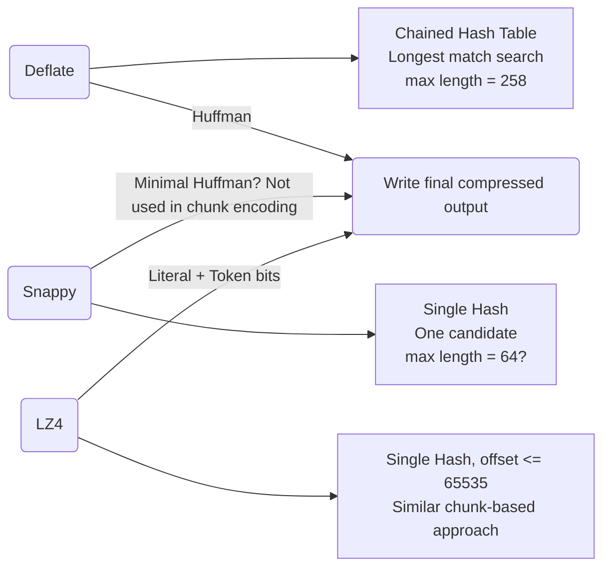

https://cefboud.github.io/posts/compression/

aliases: [Compression Algorithms, MonKafka, GZIP, Snappy, LZ4, ZSTD]
tags: [big-data, compression, algorithms, kafka, research, notes]
## Table of Contents
1. [Introduction](#introduction)
2. [Primer on Compression](#primer-on-compression)
3. [GZIP and DEFLATE](#gzip-and-deflate)
   - [DEFLATE Algorithm Details](#deflate-algorithm-details)
   - [Golang Deflate Implementation Examples](#golang-deflate-implementation-examples)
4. [Snappy](#snappy)
   - [Snappy Format Overview](#snappy-format-overview)
   - [Snappy Code Examples](#snappy-code-examples)
5. [LZ4](#lz4)
   - [LZ4 Frame Format](#lz4-frame-format)
   - [Sample LZ4 Compression Loop](#sample-lz4-compression-loop)
6. [ZSTD (Zstandard)](#zstd-zstandard)
   - [Arithmetic Coding Refresher](#arithmetic-coding-refresher)
   - [FSE (Finite State Entropy)](#fse-finite-state-entropy)
   - [Trainable Dictionaries](#trainable-dictionaries)
7. [Concluding Thoughts](#concluding-thoughts)
8. [Additional Tables & Visuals](#additional-tables--visuals)
9. [Example Code Snippets](#example-code-snippets)
10. [References & Further Reading](#references--further-reading)
## Introduction
In the context of building **MonKafka** (a custom Kafka Broker re-implementation), the need for **record batch compression** brought about an exploration of **compression algorithms**. Kafka commonly supports GZIP, Snappy, LZ4, and ZSTD. While it’s easy to import packages and call compression APIs, understanding the underlying algorithms is far more enlightening.
Compression ultimately **reduces data size**, translating to storage and bandwidth savings—especially important at **large scale**.
## Primer on Compression
1. **Lossless Compression**  
   - Perfect reconstruction of the original data.  
   - Examples: ZIP (DEFLATE), Snappy, LZ4, ZSTD.
2. **Lossy Compression**  
   - The reconstructed data is approximate. Often used in media (JPEG, MP3, etc.).
### Common Techniques
- **Run-Length Encoding (RLE)**: Replace consecutive identical elements with a single run-length pair, e.g., `AAAAAA` → `6A`.
- **Lempel-Ziv (LZ)**: Leveraging back-references to previously seen data (LZ77, LZ78, LZSS).  
- **Huffman Coding**: Variable-length codes for symbols based on frequency.
### Metrics to Optimize
1. **Compression ratio** (size reduction).  
2. **Compression speed**.  
3. **Decompression speed**.
---
## GZIP and DEFLATE
**GZIP** is a file format containing:
- **Header** (10 bytes)  
- **Payload** (compressed blocks using **DEFLATE**)  
- **Footer** (8 bytes)
**DEFLATE** combines:
1. **LZ77** (technically LZSS) for back-references.  
2. **Huffman Encoding** for shorter codes of frequent symbols.

> **Note**: DEFLATE is widely used in ZIP, DOCX, PNG, and more.
### DEFLATE Algorithm Details
- **Block Types**  
  1. **Type 0 (Uncompressed)**  
     - For data that won’t compress well.  
  2. **Type 1 (Fixed Huffman Codes)**  
     - Uses predefined Huffman codes. Simpler, but not optimal if data distribution is skewed.  
  3. **Type 2 (Dynamic Huffman Codes)**  
     - Builds custom codes based on frequency in that block. More overhead but better ratio.
- **Huffman Alphabets**:  
  - Literal/Length codes (0–255 for literal bytes, 257–285 for lengths).  
  - Distance codes (1–32768).  
- **LZ77 Sliding Window**  
  - DEFLATE uses a **chained hash table** for matching sequences (3 bytes or more).  
  - Deeper chain lookups → better matches → more CPU time.
#### RFC Quote on Chained Hash
> "The compressor uses a chained hash table to find duplicated strings, using a hash function that operates on 3-byte sequences… It compares all strings on the XYZ hash chain with the actual input data sequence…"
### Golang Deflate Implementation Examples
Below is a snippet from Go’s standard library (`compress/flate`):
```go
const (
    literalType = 0 << 30
    matchType   = 1 << 30
)

type token uint32

func literalToken(literal uint32) token {
    return token(literalType + literal)
}

func matchToken(xlength, xoffset uint32) token {
    return token(matchType + xlength<<lengthShift + xoffset)
}
```

- **`literalToken`**: stores a single literal byte in a specialized token.  
- **`matchToken`**: stores a back-reference to `(offset, length)`.

**Hash function** used for indexing sequences:

```go
const hashmul = 0x1e35a7bd

func hash4(b []byte) uint32 {
    return ((uint32(b[3]) | uint32(b[2])<<8 |
             uint32(b[1])<<16 | uint32(b[0])<<24) * hashmul) >> (32 - hashBits)
}
```

- **`hashHead` and `hashPrev`** maintain a chaining structure to find longer matches.

**Compression levels** in Go:

```go
type compressionLevel struct {
	level, good, lazy, nice, chain, fastSkipHashing int
}

var levels = []compressionLevel{
	{0, 0, 0, 0, 0, 0}, // NoCompression
	{1, 0, 0, 0, 0, 0}, // BestSpeed uses deflatefast
	{2, 4, 0, 16, 8, 5},
	{3, 4, 0, 32, 32, 6},
	{4, 4, 4, 16, 16, skipNever},
	{5, 8, 16, 32, 32, skipNever},
	{6, 8, 16, 128, 128, skipNever}, // default
	{7, 8, 32, 128, 256, skipNever},
	{8, 32,128, 258,1024, skipNever},
	{9, 32,258, 258,4096, skipNever},
}
```

- **Higher levels →** deeper chain search, bigger possible matches → better ratio, slower speed.

---

## Snappy
**Snappy**, created by Google, prioritizes **speed** over high compression ratios.  
- ~250 MB/s compression, ~500 MB/s decompression (on certain hardware).  
- Ratios around **1.5–1.7x** for plain text.

### Snappy Format Overview
- Encoded block begins with a **varint**-encoded length of the decoded data.  
- Followed by a sequence of **chunks**. Each chunk:
  - **Literal** (tag = `00` in lower bits)  
  - **Copy** (tag = `01` or `10`) referencing a prior sequence.

Example chunk types:
1. **Tag 00 (Literal)**  
   - If `m < 60`, the next `m + 1` bytes are literal data.  
   - Else, `m - 59` bytes encode the literal length.
2. **Tag 01**  
   - Offset in `[0, 1<<11)`, length in `[4,12)`.
3. **Tag 10**  
   - Offset in `[0, 1<<16)`, length in `[1,65)`.

### Snappy Code Examples
A simplified compression loop might look like:

```go
func encodeBlock(dst, src []byte) (d int) {
    var table [1 << 14]uint16
    s := 1
    nextHash := hash(load32(src, s))
    for {
        ...
        candidate := int(table[nextHash])
        table[nextHash] = uint16(s)
        if load32(src, s) == load32(src, candidate) {
            // Found a match => emit a backreference
        } else {
            // Emit literal
        }
        ...
    }
}
```

- **Snappy** typically only stores **one** candidate (not a full chain), improving speed at the expense of compression ratio.
---
## LZ4
**LZ4** is also LZ-based, released ~2011, similar to Snappy in speed & ratio:

| Compressor      | Ratio | Compression MB/s | Decompression MB/s |
| --------------- | ----- | ---------------- | ------------------ |
| **LZ4** default | 2.10  | 780              | 4970               |
| Snappy          | 2.09  | 565              | 1950               |
### LZ4 Frame Format
```
MagicNb  | Frame Descriptor | Data Block | (...) | EndMark | C.Checksum
4 bytes    3-15 bytes        ...           ...     4 bytes  0-4 bytes
```
- Blocks up to 64KB, 256KB, or 4MB (configurable).  
- **xxHash** used for checksums.  
- Offsets are 16-bit (up to 65535), though streaming modes can handle more complexity.
### Sample LZ4 Compression Loop
```go
func (c *Compressor) CompressBlock(src, dst []byte) (int, error) {
    // Hash table storing indices of recent patterns
    var table [maxTableSize]uint16
    si, anchor := 0, 0
    for si < len(src) - mfLimit {
        // Compute 3 possible hashes: si, si+1, si+2
        // Attempt a match
        ...
        // If match found, emit literal from anchor..si
        // Then extend the match forward & backward
        ...
        // Write offset, match length in "token" format
    }
    // Return compressed block length
}
```
- **Token** byte: 4 high bits = literal length, 4 low bits = match length minus 4. Additional bytes for extended lengths.
---
## ZSTD (Zstandard)
**ZSTD** was created by **Yann Collet** (also authored LZ4). Released in 2016. It aims to **match or exceed DEFLATE** in ratio but with speeds closer to LZ4

| Compressor              | Ratio | Compression | Decompression |
|-------------------------|-------|------------:|--------------:|
| **ZSTD 1.5.6 -1**       | 2.887 | 510 MB/s    | 1580 MB/s     |
| zlib 1.2.11 -1          | 2.743 | 95 MB/s     | 400 MB/s      |
| LZ4 1.9.4               | 2.101 | 700 MB/s    | 4000 MB/s     |
| Snappy 1.1.9            | 2.073 | 530 MB/s    | 1660 MB/s     |
### Arithmetic Coding Refresher
- **Huffman** uses integer bit lengths.  
- **Arithmetic coding** ideally encodes symbols proportional to their probability.  
- Issue: it can produce fractional bits. **Renormalization** tricks keep it practical, but it’s still more CPU-heavy than Huffman.
### FSE (Finite State Entropy)
- ZSTD uses **FSE**, derived from Asymmetric Numeral Systems (ANS), to achieve near-arithmetic-coding efficiency with lower CPU cost.
- Highly complex topic; the gist is that ZSTD can achieve better compression than pure Huffman.
### Trainable Dictionaries
- ZSTD allows **pre-trained dictionaries** for small data or highly repetitive patterns.  
- Very effective for specialized data (e.g., logs with common repeating patterns).
---
## Concluding Thoughts
Compression is about **removing redundancy** and representing data with fewer bits. It intersects deeply with **information theory**. Modern systems (Kafka, etc.) heavily rely on these algorithms to reduce data footprints and speed up data transfers.
Each algorithm has its **trade-offs**:
- **GZIP (DEFLATE)**: well-known, good ratio, slower.  
- **Snappy**: speed-first, moderate ratio.  
- **LZ4**: also speed-first, comparable ratio, often even faster than Snappy.  
- **ZSTD**: the latest approach, offering a wide range of speed/ratio trade-offs, often best “overall.”
Ultimately, “which algorithm to choose” depends on **use case**: is decompression speed critical? Is storage the bottleneck? Is CPU time expensive?

---
## Additional Tables & Visuals
### 1. Overview of Algorithms

| **Algorithm** | **Core Technique**                       | **Speed**                  | **Ratio**           | **Notes**                                |
| ------------- | ---------------------------------------- | -------------------------- | ------------------- | ---------------------------------------- |
| **GZIP**      | DEFLATE (LZ77+Huffman)                   | ~ 50-100 MB/s (compress)   | 2.5x–3.0x typical   | Very common, widely supported, older     |
| **Snappy**    | LZ77 variant, single chain               | ~ 200–600 MB/s (compress)  | ~ 1.5x–2.0x         | Ultra-fast, moderate ratio, from Google  |
| **LZ4**       | LZ77 variant, single chain, 4-bit tokens | ~ 300–700 MB/s (compress)  | ~ 2.0x              | Focus on speed, often faster than Snappy |
| **ZSTD**      | LZ + Huffman + FSE                       | ~ 100–600+ MB/s (compress) | ~ 2.5x–3.0x or more | Configurable levels, best of both worlds |
### 2. Deflate vs. Snappy vs. LZ4 Basic Matching Approach

**Key**: Deeper chain lookups give **better ratio** but cost more CPU.

---
## Example Code Snippets
### GZIP in Go
```go
package main

import (
    "bytes"
    "compress/gzip"
    "fmt"
    "io"
    "log"
)

func main() {
    var buf bytes.Buffer
    gz := gzip.NewWriter(&buf)
    
    data := []byte("Hello, Hello, Hello... compress me please!")
    _, err := gz.Write(data)
    if err != nil {
        log.Fatal(err)
    }
    gz.Close()
    
    // Decompress
    r, err := gzip.NewReader(&buf)
    if err != nil {
        log.Fatal(err)
    }
    decompressed, err := io.ReadAll(r)
    if err != nil {
        log.Fatal(err)
    }
    fmt.Println("Decompressed:", string(decompressed))
}
```
### LZ4 in Python (using `lz4.frame`)
```python
import lz4.frame

original_data = b"Hello LZ4. This is a demonstration of quick compression."
compressed = lz4.frame.compress(original_data)
print("Compressed size:", len(compressed))

decompressed = lz4.frame.decompress(compressed)
print("Decompressed size:", len(decompressed))
print("Decompressed string:", decompressed.decode("utf-8"))
```
---
## References & Further Reading

1. **GZIP / DEFLATE**  
   - [RFC 1951 (DEFLATE)](https://www.ietf.org/rfc/rfc1951.txt)  
   - [Go stdlib `compress/flate`](https://cs.opensource.google/go/go/+/refs/tags/go1.20.2:src/compress/flate/)
2. **Snappy**  
   - [Google Snappy GitHub](https://github.com/google/snappy)  
   - [Snappy for Go](https://pkg.go.dev/github.com/golang/snappy)
3. **LZ4**  
   - [LZ4 GitHub](https://github.com/lz4/lz4)  
   - [lz4.org](https://lz4.org/)
4. **ZSTD**  
   - [Zstandard GitHub](https://github.com/facebook/zstd)  
   - [Finite State Entropy (FSE) Explainer](https://fastcompression.blogspot.com/)  
   - [Asymmetric Numeral Systems by Jarek Duda](https://www.youtube.com/watch?v=qqYD2nqU1QI)
5. **Further Talks / Lectures**  
   - Bill Bird’s lectures on DEFLATE.  
   - Yann Collet’s presentations (author of LZ4, ZSTD).