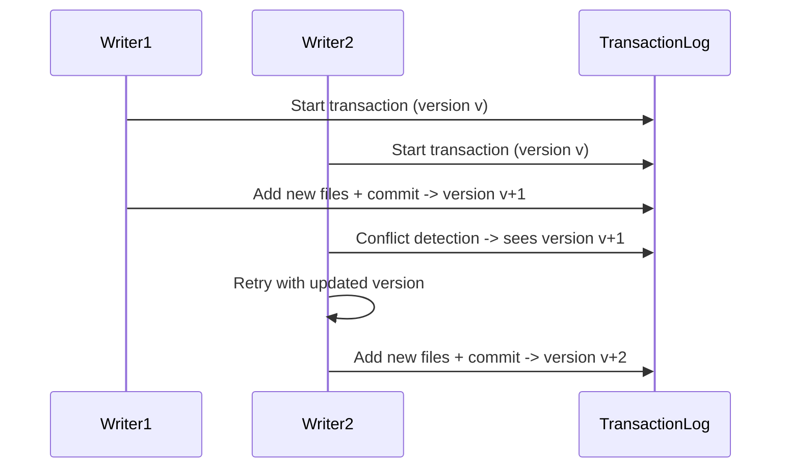

## Extended Topics

1. [Transactional Guarantees and Concurrency Control](#transactional-guarantees-and-concurrency-control)  
2. [Handling Streaming and Incremental Updates](#handling-streaming-and-incremental-updates)  
3. [Multi-Modal Data in a Lakehouse](#multi-modal-data-in-a-lakehouse)  
4. [Distributed Metadata and Scale-Out Management](#distributed-metadata-and-scale-out-management)  
5. [Best Practices for Lakehouse Adoption](#best-practices-for-lakehouse-adoption)  
6. [Additional Visualizations and Examples](#additional-visualizations-and-examples)

---

### Transactional Guarantees and Concurrency Control

A Lakehouse system extends open data lake storage (e.g., S3, HDFS) with a **transactional metadata layer**. This raises key questions regarding **ACID guarantees** in a cloud environment with eventually consistent object stores.

1. **ACID Transactions**  
   - **Atomicity & Consistency**: Any write that moves the table from version \(v\) to \(v+1\) is recorded in a **transaction log**.  
   - **Isolation**: Writers see the last committed version. Concurrent writers operate on separate log entries, and a single “commit coordinator” logic ensures no partial updates.  
   - **Durability**: Once the metadata is committed, the system can recover the exact table state from the transaction log even if local caches fail.  

2. **Optimistic Concurrency Control (OCC)**  
   - Many implementations (e.g., **Delta Lake**) employ OCC. Writers:  
     1. **Read** the current table version.  
     2. Apply changes (e.g., add new Parquet files or mark some as removed).  
     3. Attempt to **commit** to the transaction log. If a conflict is detected (another writer updated the same set of partitions or files), the transaction is retried with updated metadata.  
   - This approach scales well for **append-heavy** or **streaming** ingestion with minimal conflicts.

3. **Cross-Table Transactions**  
   - Current Lakehouse systems typically focus on **single-table** transactions.  
   - Future research may extend concurrency to **multi-table** operations (e.g., ACID commits spanning several tables).  
   - **Implementation Complexity**: Potentially requires a global transaction manager or distributed lock service.

4. **Isolation Levels**  
   - Typically, Lakehouse systems default to **snapshot isolation**. Readers always see a consistent snapshot (a specific version). Writers do not block readers, enabling **high concurrency**.  
   - **Serializable** isolation is more complex and less common in large-scale batch systems, but is an emerging research topic.

---

### Handling Streaming and Incremental Updates

**Incremental data ingestion** and **real-time analytics** have become mainstream in modern data pipelines. The Lakehouse can:

1. **Continuous Ingestion**  
   - Data arrives from streaming sources (e.g., Kafka, Kinesis) and is appended to the Lakehouse in micro-batches or near real-time increments.  
   - Each micro-batch leads to a new table version, enabling time-travel if needed.

2. **Structured Streaming Integration** (e.g., **Spark Structured Streaming**)  
   - Allows a job to treat a Lakehouse table as a *sink*, ensuring exactly-once semantics when writing.  
   - The table’s transaction log ensures atomic appends and consistent snapshots for downstream consumers.

3. **Incremental Data Processing**  
   - ETL logic can be defined once and triggered whenever new data arrives.  
   - Because each table version is recorded, transformations can skip data already processed (via transaction log “checkpoints”).

4. **Near-Real-Time Queries**  
   - Streaming data from IoT devices or logs can be available to queries in seconds (or sub-seconds) if using short micro-batches.  
   - **Challenge**: Ultra-low-latency (true real-time) might still require specialized streaming engines or in-memory data stores for sub-second analytics. The Lakehouse excels at near-real-time (seconds to minutes).

---

### Multi-Modal Data in a Lakehouse

Modern enterprises handle diverse data types—images, audio, IoT sensor data, documents, etc. Lakehouses, by virtue of **open storage formats** and flexible metadata, can manage:

1. **Unstructured File Management**  
   - Files (e.g., JPEG, PDF) stored in the same object store as structured data.  
   - The transaction log can track unstructured file versions, enforce retention policies, and unify security across all data.  

2. **Annotations and Indexing**  
   - Extended table schemas or sidecar metadata can store references to embeddings or partial descriptors of unstructured data (e.g., bounding boxes in images).  
   - Query pushdown (for unstructured data) remains an open research area—some proposals add embedded metadata or advanced indexing (e.g., vector indexes for deep learning).  

3. **ML Pipelines**  
   - Data scientists can run feature extraction tasks on unstructured data (images, text) **in-place** and store derived features in Lakehouse tables.  
   - Eliminates the need to copy large media archives to specialized ML file systems.

---

### Distributed Metadata and Scale-Out Management

As Lakehouses grow, tables can reach **billions** of objects. A single transaction log file or single metadata server can become a bottleneck.

1. **Metadata Sharding**  
   - Large tables can be split into multiple “regions” or “manifests,” each governed by its own transaction sub-log.  
   - A top-level coordinator merges sub-logs for global consistency.

2. **Cache Invalidation and Coordination**  
   - When table version changes, any caching service must invalidate or refresh file metadata.  
   - **Hybrid Approaches**: The transaction log remains an “append-only” artifact, but a separate indexing system can be distributed across a cluster (e.g., a key-value store).

3. **Performance Considerations**  
   - High concurrency of commits can saturate cloud object stores.  
   - Potential solution: a **fast key-value store** (e.g., FoundationDB or etcd) as a “front-end” for metadata commits, with periodic checkpoints to the slower, more durable object store.

4. **Resiliency and HA**  
   - If the metadata engine is embedded in the object store (like Delta Lake’s JSON/Parquet logs), the system remains highly available with minimal extra infra.  
   - If a specialized metadata service is used, it must replicate logs for fault-tolerance.

---

### Best Practices for Lakehouse Adoption

1. **Data Ingestion Path**  
   - **Raw Zone** in the Lakehouse (landing area for new data).  
   - **Curated Zone** for clean, standardized tables ready for consumption.  
   - **Use versioning** to safely experiment without overwriting production data.

2. **Data Layout & Partitioning**  
   - Partition or cluster large tables on frequently used predicate columns (e.g., date, region).  
   - Use **Z-order clustering** for multi-dimensional queries.

3. **Caching Strategy**  
   - Cache popular partitions in SSD or memory for repeated queries.  
   - Be mindful of **eviction policies**—stale caches can degrade performance if not invalidated.

4. **Monitoring & Observability**  
   - Centralize logs of commit operations, table versions.  
   - Automated anomaly detection if data volume changes unexpectedly or if queries degrade in performance.

5. **Security & Governance**  
   - Integrate the Lakehouse with standard IAM solutions (e.g., Azure AD, AWS IAM).  
   - Use object store access controls + metadata-layer ACLs to unify permission checks.

---

### Additional Visualizations and Examples

#### 1. Lakehouse Table Life Cycle

```mermaid
flowchart LR
   A[Raw Data (JSON/CSV/IOT Logs)] --> B[Ingest to Lakehouse]
   B --> C[New Table Version Created]
   C -->|Periodic or streaming| D[Data Validation/ETL]
   D --> E[Curated Table Versions]
   E --> F[BI/SQL Queries]
   E --> G[ML Feature Engineering]
```

**Notes**:
- Each ingestion round produces a **new version** in the transaction log.  
- Downstream transformations can read the curated table state or revert if errors are found.

#### 2. Simplified Delta Lake Concurrency Flow



**Key Point**: Both writers start on version `v`. The second detects a conflict when it sees that version `v` was superseded; it retries on top of the newly committed version `v+1`.

---

### Closing Remarks on Advanced Topics

The Lakehouse model aligns strongly with modern data engineering workflows:  
- **Unifies** structured and unstructured data.  
- **Reduces** pipeline complexity by removing the “split” between lake and warehouse.  
- **Supports** streaming ingestion and concurrency at scale, albeit requiring new approaches for metadata scaling.  
- **Enables** near-real-time analytics and advanced ML on the same platform.

**Research** is ongoing in cross-table ACID transactions, new open file formats, serverless Lakehouse queries, and better integration with ML/AI frameworks. As the Lakehouse matures, we can expect more refined **metadata distribution**, **indexing** for unstructured data, and **governance** features tailored to compliance and multi-tenant security.

---

> **End of Extended Notes**  

These additional details should help you deepen your understanding of Lakehouse internals, the challenges of large-scale transaction management on object stores, approaches to streaming data, and best practices for adopting the Lakehouse paradigm. Feel free to incorporate these extended notes into an **Obsidian** vault for further cross-linking, referencing, and exploration in your PhD-level research.