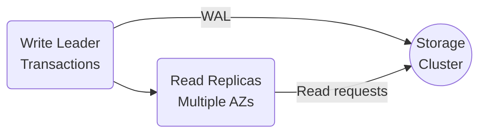

aliases: [Amazon Aurora Technical Details]
tags: [oltp, database, aws, aurora, rds, research, notes]

These notes summarize and clarify key **technical details** of Amazon Aurora based on the provided YouTube transcript (which may contain typos). Aurora is an **OLTP** database managed as a native AWS service, offering **separation of compute and storage**, quorum-based replication, and significant optimizations over MySQL’s traditional storage engine.

## Table of Contents
1. [Introduction and Context](#introduction-and-context)
2. [Overview of Amazon Aurora](#overview-of-amazon-aurora)
3. [Separation of Compute and Storage](#separation-of-compute-and-storage)
4. [Write-Ahead Logging (WAL) and Log-Derived State](#write-ahead-logging-wal-and-log-derived-state)
5. [Quorums and Fault Tolerance](#quorums-and-fault-tolerance)
6. [Partitioning with 10GB Segments](#partitioning-with-10gb-segments)
7. [Leader-Follower Architecture](#leader-follower-architecture)
8. [Reducing Write Amplification](#reducing-write-amplification)
9. [Page Generation in Aurora](#page-generation-in-aurora)
10. [Log Semantics and Durable Points](#log-semantics-and-durable-points)
11. [High-Level Architecture Diagram](#high-level-architecture-diagram)
12. [Code Examples](#code-examples)
13. [Tables and Visual Summaries](#tables-and-visual-summaries)
14. [Additional Notes](#additional-notes)

---

## 1. Introduction and Context
- **Aurora** is an **OLTP** (Online Transaction Processing) database service from AWS.  
- Focus: **low-latency, transactional** operations, unlike data warehouses or analytics engines.  
- It’s **cloud-native**: fully managed by AWS, allowing **scale-up/scale-down** relatively easily (though there are still practical limits).  
- Built to replace or enhance self-hosted **MySQL** (and **PostgreSQL** in some variants) with better performance, reliability, and manageability in the cloud.

### Why Cloud-Native Matters
- No need to **provision or maintain physical servers** in your own data center.  
- Aurora leverages **AWS infrastructure** (EC2 instances, SSD storage, multi-AZ replication).  
- Simplified operations: just “click a few buttons” or use AWS CLI to increase capacity and throughput.

---

## 2. Overview of Amazon Aurora
1. **Separation of Compute and Storage**  
   - Aurora’s architecture is split into a *Database layer* (compute) and a *Storage layer*.
   - The database layer runs the MySQL/Postgres-compatible front-end logic (parsing SQL, caching pages, handling transactions).
   - The storage layer runs on specialized AWS-managed instances that store data blocks and replicate them across **Availability Zones**.

2. **Performance Characteristics**  
   - Designed to reduce “write amplification” typical in MySQL’s InnoDB engine.
   - Emphasizes **write-ahead logging (WAL)** to minimize writes on the critical path.

3. **Auto-Scaling**  
   - More flexible than self-hosted MySQL: can scale storage up/down independently from compute.
   - Facilitates use cases where data size and compute demands don’t necessarily match.

---

## 3. Separation of Compute and Storage
- **Traditional MySQL**: database and storage are tightly coupled on the same node. This leads to multiple writes:
  - InnoDB writes to a binlog, page files, double-write buffers, etc.
- **Aurora**:  
  - The “compute” layer is one set of EC2 instances that handle SQL queries, caching, transaction coordination.  
  - The “storage” layer is a distributed cluster of AWS-managed nodes (still EC2 under the hood, but specialized):
    - Typically SSD-backed, optimized for continuous writes.  
    - Distributed across **three Availability Zones (AZs)** for fault tolerance.

```mermaid
flowchart LR
    A[Compute Layer<br>(Aurora DB Engine)] -->|Sends WAL Records| B[Storage Layer<br>(Distributed Storage Nodes)]
    B -->|Confirmation/Quorum| A
```

**Benefit**: You can scale storage capacity (up to multiple TB) without changing your compute node size, or vice versa.

---

## 4. Write-Ahead Logging (WAL) and Log-Derived State
- Aurora uses **WAL** as the **source of truth**.  
- All writes funnel into a **single log stream** (at least for each partition/segment).  
- The system heavily relies on these WAL entries to derive the actual data pages when needed.

### Why WAL-Centric?
- Minimizes the overhead of synchronously writing multiple data structures on each transaction commit (e.g., binlog, double-write buffer, pages).  
- Minimizes network I/O by sending primarily WAL records across the cluster.

---

## 5. Quorums and Fault Tolerance
Aurora replicates each data partition across **six storage nodes** distributed across **three AZs**. 

- **2 replicas** per availability zone (AZ).  
- Quorum for **writes** = 4 out of 6.  
- Quorum for **reads** = 3 out of 6.

### Why 6 replicas with W=4, R=3?
- Survives the loss of an entire AZ (2 replicas) plus random additional failures.  
- Ensures that if a write is committed in 4 out of 6 nodes, any read quorum of 3 nodes will see the write from at least one node.

Example:
- If AZ1 fails completely, we still have 4 nodes across AZ2 and AZ3. Reads and writes continue uninterrupted.

---

## 6. Partitioning with 10GB Segments
- Aurora logically breaks the database into **10GB segments** (sometimes called “protection groups”).  
- Each segment is replicated 6 times (2 in each AZ).  
- **Motivation**:
  - Keep segment size relatively small → faster repair and re-replication.  
  - **Median Time to Repair (MTTR)** < **Median Time to Failure** = system can reconstruct lost replicas quickly.

### Repair Example
- If a node fails, Aurora only needs to copy up to 10GB from an existing healthy replica to a new node.  
- Typically done in ~10 seconds or so, restoring full 6-replica redundancy.

---

## 7. Leader-Follower Architecture
- **One “Leader” node** for each Aurora cluster manages all write transactions.  
- The leader assigns **monotonically increasing sequence numbers** to each transaction, generating a global ordering.  
- **Reader nodes** (a.k.a. “read replicas”) can offload read requests:
  - They maintain a local cache.  
  - They consult the storage layer as needed.



**Note**: All writes go through the leader, but the leader can track which storage nodes have the most recent WAL entries (no need for a read quorum if the leader knows the location of fully up-to-date data).

---

## 8. Reducing Write Amplification
**MySQL InnoDB** typically writes:
1. Write-Ahead Log  
2. Data pages / indexes  
3. Double-write buffer (for torn-page protection)  
4. Binary log for replication

**Aurora**:
- Minimizes these overheads:
  - **Primary** synchronous write = WAL log record.  
  - Storage nodes apply logs asynchronously to generate pages.  
  - Binlog is optional only if you do cross-region replication or need MySQL binlog for external use.

**Result**: Lower latency in the critical path and better throughput.

---

## 9. Page Generation in Aurora
- The **storage layer** is responsible for applying WAL entries to construct or update data pages.  
- This is done **asynchronously**:
  - If the storage layer is busy, it can delay the page materialization.  
  - The DB leader or readers can fetch the latest page + relevant logs to reconstruct the “correct” data version on demand.  

### Contrast with MySQL
- MySQL node does WAL writes **and** page writes synchronously.  
- Aurora offloads page updates to the distributed storage layer → improved concurrency and throughput.

---

## 10. Log Semantics and Durable Points
- Because all writes flow through a single leader, each WAL record has an **incremental sequence ID**.  
- **Storage nodes** may miss some WAL records (e.g., network hiccup), but they **gossip** with each other or get backfilled from the leader.  
- **Durable Point**:  
  - The highest sequence number (SN) for which all partitions have achieved the required write quorum.  
  - Once a durable point is established, Aurora can confirm the transaction commit to the client.

---

## 11. High-Level Architecture Diagram

Below is a **simplified** mermaid diagram to visualize Aurora’s architecture across 3 AZs, each containing 2 storage replicas. The leader writes to any 4 replicas to achieve write durability:

```mermaid
flowchart TB
    subgraph Leader & Replicas
        L(Leader Node) --> R1(Read Replica 1)
        L --> R2(Read Replica 2)
    end

    subgraph Availability Zone A
        SA1(Replica SA1)
        SA2(Replica SA2)
    end

    subgraph Availability Zone B
        SB1(Replica SB1)
        SB2(Replica SB2)
    end

    subgraph Availability Zone C
        SC1(Replica SC1)
        SC2(Replica SC2)
    end

    L -->|WAL entries| SA1
    L -->|WAL entries| SA2
    L -->|WAL entries| SB1
    L -->|WAL entries| SB2
    L -->|WAL entries| SC1
    L -->|WAL entries| SC2

    note over SA1,SC2: <b>Storage Layer<br>(6 Replicas, 2 per AZ)</b>
```

**Key**:  
- Leader node writes the WAL to 6 storage replicas (2 in each AZ).  
- Write is acknowledged once 4 out of 6 confirm.  
- Read replicas also exist to offload queries and can fetch from storage or from their local cache.

---

## 12. Code Examples

### 12.1. Basic Aurora MySQL Connection (Python)

```python
import pymysql

# Example: Connect to Aurora MySQL instance
connection = pymysql.connect(
    host='aurora-cluster-xyz.cluster-12345.us-east-1.rds.amazonaws.com',
    user='admin',
    password='secret123',
    db='myappdb',
    connect_timeout=5
)

try:
    with connection.cursor() as cursor:
        # A simple transaction
        cursor.execute("START TRANSACTION")
        
        # Insert data
        insert_query = """
            INSERT INTO orders (order_id, user_id, amount)
            VALUES (%s, %s, %s)
        """
        cursor.execute(insert_query, (101, 5, 2500))

        # Commit
        connection.commit()
        print("Transaction committed successfully.")

finally:
    connection.close()
```

**Explanation**:  
- Although code is typical for MySQL, behind the scenes Aurora uses its distributed WAL and quorum mechanism.

### 12.2. Checking Aurora Cluster Status (AWS CLI)

```bash
aws rds describe-db-clusters \
  --db-cluster-identifier my-aurora-cluster
```

**Output** might show the cluster endpoint, read replicas, number of AZs used, etc.

---

## 13. Tables and Visual Summaries

### 13.1. Quorum Levels

| **Parameter** | **Value** | **Meaning**                                        |
|---------------|-----------|----------------------------------------------------|
| Write Quorum  | 4 of 6    | A transaction commit is confirmed if 4 storage replicas have the WAL. |
| Read Quorum   | 3 of 6    | Must read from at least 3 replicas to ensure seeing the latest committed data. |
| AZ Replicas   | 2 per AZ  | 3 AZs total → 6 replicas per data partition.       |

### 13.2. Latency Optimization Techniques

| **Technique**       | **Description**                                                                 |
|---------------------|---------------------------------------------------------------------------------|
| **WAL Focus**       | Minimize synchronous writes to the log only.                                    |
| **Async Page Ops**  | Storage nodes apply WAL to pages asynchronously.                                |
| **Distributed Replication** | 6 copies across 3 AZs with partial quorums → minimal overhead on the leader. |
| **Leader-based Ordering**   | Single leader node assigns monotonically increasing sequence numbers → simpler concurrency. |

---

## 14. Additional Notes

1. **Storage Format**  
   - Aurora’s storage nodes are actually EC2 instances with local SSD, not an object store like S3. This allows **low-latency** random I/O.

2. **Replica Caches**  
   - Each read replica has an in-memory buffer pool. If data is not present, it fetches from storage (pages + relevant WAL segments).

3. **Handling Failures**  
   - If the leader node fails, Aurora automatically **promotes** a read replica to be the new leader. The newly promoted leader has a consistent log view from the storage layer.

4. **Trade-offs**  
   - Strictly consistent reads can require the leader to confirm the read location. For “eventual consistency,” you might read from a lagging replica with some staleness.

5. **Cost Model**  
   - Pay for **compute** (per instance, size) and **storage** (GB-month plus I/O).  
   - Aurora can be more cost-efficient than spinning up large MySQL clusters for many workloads, though for smaller workloads, simpler setups might suffice.

---

> ### How to Use These Notes in Obsidian
> - **Linking**: Use `[[Amazon Aurora Technical Details]]` to reference or embed sections in other notes.  
> - **Tagging**: Tag key sections with `#oltp`, `#aws-aurora`, `#mySQL` for easy cross-referencing.  
> - **Diagram Embeds**: In Obsidian, the mermaid code blocks render as diagrams, giving you a quick at-a-glance architecture overview.  
> - **Future Research**: Add your own sections on **performance benchmarks**, **real-world Aurora use cases**, or **comparing Aurora vs. standard MySQL**.  

---

## References
- **Aurora Paper**: *End-to-end design of an AWS OLTP service* or Amazon’s official Aurora technical documentation.  
- **AWS RDS**: [Official Aurora Documentation](https://docs.aws.amazon.com/AmazonRDS/latest/AuroraUserGuide/CHAP_AuroraOverview.html)
```