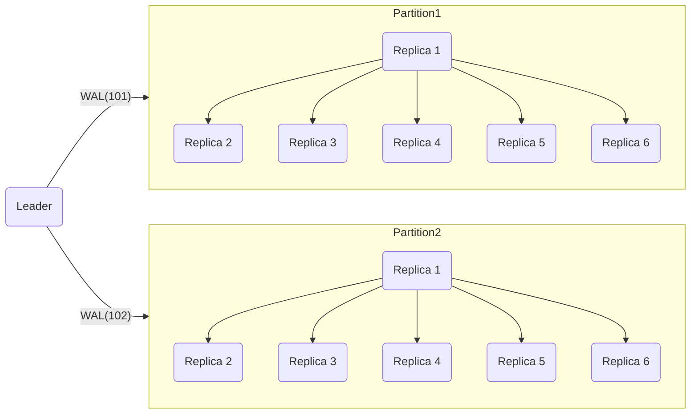
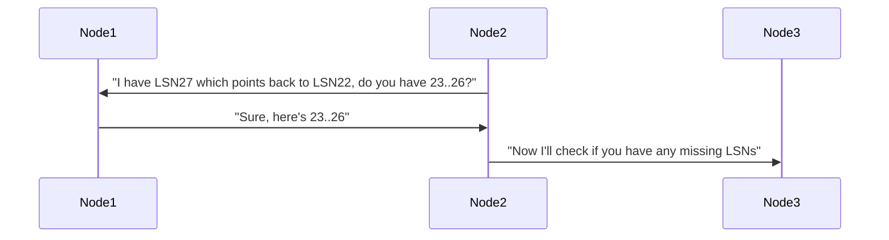
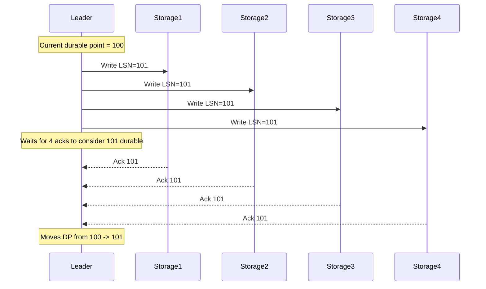

aliases: [Amazon Aurora Technical Details - Part 2]
tags: [oltp, database, aws, aurora, rds, research, notes]

This note is a **continuation** of the detailed technical overview of Amazon Aurora. The content below further explains **Aurora’s durability point**, **storage gossip**, **read replica behavior**, and **recovery** processes, among other considerations.

> *Note*: The transcript may contain typos; these notes aim to present a clarified version of the ideas.
## Table of Contents
1. [Recap of Key Concepts](#recap-of-key-concepts)
2. [Durable Point and Commit Semantics](#durable-point-and-commit-semantics)
   - [Detailed Example of Concurrent Writes](#detailed-example-of-concurrent-writes)
3. [Storage Gossip](#storage-gossip)
4. [Commit Ordering and the Durable Point](#commit-ordering-and-the-durable-point)
5. [Reading in Aurora](#reading-in-aurora)
6. [Read Replicas and Log Propagation](#read-replicas-and-log-propagation)
7. [Recovery Mechanics](#recovery-mechanics)
8. [Conclusions on Aurora Architecture](#conclusions-on-aurora-architecture)
9. [Additional Visualizations](#additional-visualizations)
10. [Code Snippets](#code-snippets)
11. [Comparison Table: Traditional MySQL vs Aurora](#comparison-table-traditional-mysql-vs-aurora)
12. [Further Notes and Observations](#further-notes-and-observations)
## 1. Recap of Key Concepts
To situate the new material, let’s recap:
1. **Aurora** separates **compute** (database nodes) from **storage** (distributed across multiple AZs).
2. **Each partition** (or segment) has **6 replicas**, stored as **10GB** chunks in the storage layer.
3. **Quorum** for **writes** = 4 of 6, for **reads** = 3 of 6.
4. **Writes** funnel through a **leader** node that assigns monotonic sequence numbers.
5. **Log = source of truth**; the storage layer asynchronously materializes pages from the WAL.
## 2. Durable Point and Commit Semantics
When a client issues a write transaction, Aurora’s leader coordinates its commit. The **Durable Point** (DP) is the highest log sequence number (**LSN**) where:
- Each partition’s storage quorum has acknowledged the write.  
- All earlier writes (LSNs < DP) are also confirmed durable.

This ensures strict ordering and **linearizability** of commits.
### 2.1. Why a Durable Point?
- Guarantees no “gaps” in the commit sequence.  
- Prevents a higher LSN from being marked durable before all preceding LSNs are truly persisted.
### Detailed Example of Concurrent Writes

1. **Transaction 1** (sequence 101) goes to Partition1. Some replicas are slow, so it takes time to reach 4 out of 6.
2. **Transaction 2** (sequence 102) goes to Partition2. This might complete its quorum **before** 101 is fully acknowledged on Partition1.
Even if 102’s partition is done, the **global durable point** cannot move to 102 until 101 is fully durable.

---
## 3. Storage Gossip
Within **one partition**, Aurora’s storage nodes use **back-pointers** in the WAL entries to detect missing log records and perform **backfills** from each other.
- Each log record references the previous LSN.  
- A storage node noticing a gap (e.g., it has LSN 22 and 27 but not 23–26) requests the missing records from peers.
This mechanism ensures all replicas eventually become up-to-date.


## 4. Commit Ordering and the Durable Point
1. **Global ordering** is possible because all writes funnel through the **same leader**.  
2. The durable point is advanced **one LSN** at a time:
   - If LSN=101 is slow, LSN=102 must wait, even if 102 already finished.  
   - Only once 101 is confirmed, can the leader move the DP to 102 (and so on).
**Implication**: Aurora ensures **strictly increasing** commits and linearizability at the cost of requiring that single leader approach.

---
## 5. Reading in Aurora
- When a client issues a **SELECT**, the leader (or read replica) assigns a **read point** = current **durable point**.
- The node checks its local **page cache** or requests data from a known up-to-date storage replica.  
- Since the leader tracks which storage replicas have each LSN, it doesn’t need a quorum read if it knows a particular replica is sufficiently advanced.
**Visibility**: Only writes <= DP (durable point) are visible to the query.

---
## 6. Read Replicas and Log Propagation
Aurora can have up to **15 read replicas**. They receive **log updates** directly from the leader:
1. **Log Shipping**: The leader sends new WAL entries to each replica.  
2. The replica holds them in memory or partially applies them to pages.  
3. **Replica only marks them “committed/visible”** once it learns the DP has advanced.
This design is **eventually consistent** from the replica’s perspective, but the delay is usually small.

---
## 7. Recovery Mechanics
When a database node restarts or a new leader is promoted:
1. **Storage nodes** independently recover:
   - They apply the WAL to their latest checkpoint to rebuild pages.
2. **Database node** finds the **global durable point** by querying storage nodes:
   - It checks each replica’s highest contiguous LSN.  
   - Uses quorum rules to determine the official durable point.
This is faster than a traditional MySQL crash recovery because the storage layer handles most checkpointing and page reconstitution **asynchronously**.

---
## 8. Conclusions on Aurora Architecture
- **Log as the Sole Source of Truth**: Minimizes write amplification, reduces network overhead.  
- **Compute-Storage Separation**:  
  - Storage layer does background checkpointing; compute nodes can quickly service new writes after a crash.  
  - Simplifies scaling: compute can be upgraded (larger instances), storage can auto-scale in 10GB segments.  
- **Quorums**: Achieve high availability and fault tolerance across multiple AZs.  
- **Single Leader**:  
  - Ensures linearizable writes.  
  - Potentially a bottleneck for “infinite scale,” but practical scaling remains high for most workloads.
---
## 9. Additional Visualizations
### 9.1 Durable Point Illustration


**But** if there’s a concurrent 102 on another partition, 102 can only be reported to the client after 101 is confirmed, to preserve in-order commit.

---
## 10. Code Snippets
### 10.1. Aurora Connection and Query (Java)

```java
import java.sql.Connection;
import java.sql.DriverManager;
import java.sql.PreparedStatement;

public class AuroraSample {
  public static void main(String[] args) throws Exception {
    String url = "jdbc:mysql://aurora-cluster-endpoint:3306/mydb";
    String user = "admin";
    String password = "secret";

    try (Connection conn = DriverManager.getConnection(url, user, password)) {
      // Example transaction
      conn.setAutoCommit(false);

      PreparedStatement stmt = conn.prepareStatement(
        "INSERT INTO accounts (user_id, balance) VALUES (?, ?)"
      );
      stmt.setInt(1, 42);
      stmt.setDouble(2, 1000.0);
      stmt.executeUpdate();

      conn.commit();
      System.out.println("Committed transaction!");
    }
  }
}
```
### 10.2. Using AWS CLI for Failover Testing

```bash
# Promote a read replica to become the new writer in an Aurora cluster
aws rds failover-db-cluster \
  --db-cluster-identifier my-aurora-cluster \
  --target-db-instance-identifier my-aurora-replica
```
**Note**: This triggers a **controlled** failover in the Aurora cluster; the former read replica becomes the new writer (leader).

---
## 11. Comparison Table: Traditional MySQL vs Aurora

| Aspect                   | MySQL (InnoDB)                              | Amazon Aurora                                          |
|--------------------------|---------------------------------------------|--------------------------------------------------------|
| **Architecture**         | Storage + compute tightly coupled           | Decoupled storage layer + compute layer               |
| **Write Amplification**  | Multiple writes (binlog, double write, etc.)| Single WAL-based write path to storage                |
| **Quorum**               | Not used by default (master-slave)          | 6 replicas per segment, W=4, R=3 across 3 AZs         |
| **Crash Recovery**       | Done by master (InnoDB logs, pages)         | Storage nodes handle checkpoint replay; leader quickly recalculates DP |
| **Scaling**              | Vertical scaling or sharding is complex     | Horizontal storage scale + up to 15 read replicas     |
| **Availability**         | Often single AZ or with synchronous rep.    | Built-in multi-AZ (3 AZs), region-level fault tolerance |
## 12. Further Notes and Observations
1. **Atomic Writes Within Mini-Transactions**  
   - Aurora ensures internal atomicity for each multi-statement transaction.  
   - Log entries from the same transaction commit appear at once after the DP moves.
2. **Possible Bottleneck**: Single-writer leader approach.  
   - Many OLTP apps can handle tens/hundreds of thousands of writes per second. Aurora scales well in practice.  
   - True infinite scale might require further partitioning or multi-leader designs.
3. **Fast Recovery**  
   - Once the node restarts, it quickly replays which WAL segments are needed from the storage layer to identify the latest DP, no heavy local “crash recovery” needed.
4. **Cost and Resource Management**  
   - Pay for DB instances (CPU, RAM) separately from storage usage (GB-month, I/O).  
   - Ideal for workloads where storage demands and compute demands differ significantly.